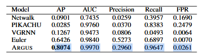

## Test_1
```
Namespace(delta=0.1, encoder_name='ARGUS', rnn='GRU', hidden=32, zdim=16, load=False, gpu=False, te_end='test', fpweight=0.5, dataset='OPTC', lr=0.005, patience=10, nratio=1, epochs=100, flows=True, loss='default')
```

Early stopping!
Exiting train loop
Avg TPE: 29.0355s
start:544626, end:573290
Finding start: 100%|██████████████████████████████████████████████████████████████████████| 4625/4625 [00:01<00:00, 2514.40it/s]
Seconds read: 28801it [00:01, 15700.16it/s]                                                                                     
Optimal cutoff 0.9926 achieves TPR: 0.92 FPR: 0.08 on train data
Loading test data
start:573290, end:745983
Finding start: 100%|██████████████████████████████████████████████████████████████████████| 3289/3289 [00:02<00:00, 1460.17it/s]
Seconds read: 172820it [00:02, 76723.88it/s]                                                                                    
Embedding Test Data...
tn, fp, fn, tp:  93804 13351 51 1167
Learned Cutoff 0.9926
TPR: 0.9581, FPR: 0.1246
TP: 1167  FP: 13351
F1: 0.14832232
AUC: 0.9805  AP: 0.7123

* AP = 0.7123
* AUC = 0.9805
* Precision = 0.0804
* Recall = 0.9581
* FPR = 0.1246


## template
$$
    Precision = \frac{TP}{TP+FP} \\
    Recall = \frac{TP}{TP+FN} \\
    FPR = \frac{FP}{TN+FP}
$$

* AP = 
* AUC = 
* Precision = 
* Recall = 
* FPR = 



## Test_2

```
Namespace(delta=0.1, encoder_name='ARGUS', rnn='GRU', hidden=32, zdim=16, load=False, gpu=False, te_end='test', fpweight=0.6, dataset='OPTC', lr=0.005, patience=10, nratio=1, epochs=100, flows=True, loss='default')
```
Early stopping!
Exiting train loop
Avg TPE: 31.0017s
start:544626, end:573290
Finding start: 100%|██████████████████████████████████████████████████████████████████████| 4625/4625 [00:01<00:00, 2722.71it/s]
Seconds read: 28801it [00:01, 17013.65it/s]                                                                                     
Optimal cutoff 0.9639 achieves TPR: 1.00 FPR: 0.33 on train data
Loading test data
start:573290, end:745983
Finding start: 100%|██████████████████████████████████████████████████████████████████████| 3289/3289 [00:02<00:00, 1387.56it/s]
Seconds read: 172820it [00:02, 72907.88it/s]                                                                                    
Embedding Test Data...
tn, fp, fn, tp:  106962 193 380 838
Learned Cutoff 0.9639
TPR: 0.6880, FPR: 0.0018
TP: 838  FP: 193
F1: 0.74522010
AUC: 0.9805  AP: 0.7123

* AP = 0.7123
* AUC = 0.9805
* Precision = 0.8128
* Recall = 0.6880
* FPR = 0.0018


|    | Article | Practice |
| ---- | ---- | ---- |
| AP | 0.8074 |  0.7123 |
| AUC | 0.9970 | 0.9805 |
|Precision|0.2960|0.8128|
|Recall|0.9647|0.6880|
|FPR|0.0261|0.0018|

## Test_3

Early stopping!
Exiting train loop
Avg TPE: 29.0989s
start:544626, end:573290
Finding start: 100%|██████████████████████████████████████████████████████████████████████████████████████████████████████████████████████████████████████████████████████| 4625/4625 [00:01<00:00, 2824.79it/s]
Seconds read: 28801it [00:01, 17671.49it/s]                                                                                                                                                                     
Cutoff 0.9898 achieves TPR: 0.96 FPR: 0.11 on train data
Loading test data
start:573290, end:745983
Finding start: 100%|██████████████████████████████████████████████████████████████████████████████████████████████████████████████████████████████████████████████████████| 3289/3289 [00:02<00:00, 1464.10it/s]
Seconds read: 172820it [00:02, 76928.85it/s]                                                                                                                                                                    
Embedding Test Data...
tn, fp, fn, tp:  99462 7693 86 1132
Learned Cutoff 0.9898
TPR: 0.9294, FPR: 0.0718
TP: 1132  FP: 7693
F1: 0.22543065
AUC: 0.9805  AP: 0.7122

* AP = 0.7122
* AUC = 0.9805
* Precision = 0.1282
* Recall = 0.9294
* FPR = 0.0718

|    | Article | Practice |
| ---- | ---- | ---- |
| AP | 0.8074 |  0.7122 |
| AUC | 0.9970 | 0.9805 |
|Precision|0.2960|0.1282|
|Recall|0.9647|0.9294|
|FPR|0.0261|0.0718|