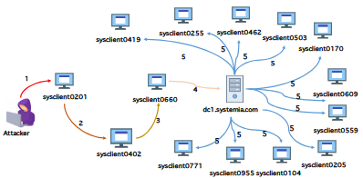
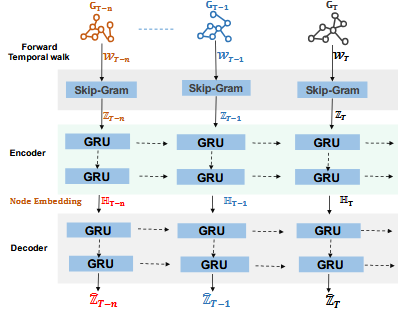

NIDS: ARGUS, EULER, PIKACHU

## PIKACHU

- *PIKACHU: Temporal Walk Based Dynamic Graph Embedding for Network Anomaly Detection*

- Explain the lateral movement in OpTC network during day 1 attack campaign

### Key

- In all: a **unsupervised** node **embedding technique** that capture both **topological** and **temporal** information

- 1. breaks down the graph stream into a sequence of static snapshots and uses the temporal walk to traverse each snapshot
- 2. the Skip-gram model is used to capture the topological and granular temporal information by maximizing the likelihood of preserving the temporal order of the node.
- 3. gated-recurrent unit (GRU)-based auto-encoder is used for learning long-term temporal information

- Visual illustration of PIKACHU framework

### Background and Motivation

- Use **Temporal Walk** to indicate the lateral movement in attacks
- The time-order are firstly considered

### Graph Traversal

- By uniform random distribution when facing choices
- **Temporal Neiborhood**

### Skip-Gram model

#### From Copilot

The **skip-gram model** is a widely used neural network model in Natural Language Processing (NLP) for learning word representations, also known as word embeddings. It was introduced as part of the Word2Vec framework by Mikolov et al. in 2013.

##### Key Idea

The skip-gram model aims to learn vector representations of words such that words appearing in similar contexts have similar vectors. It does this by predicting the context words surrounding a given target word within a fixed window size.

##### How it Works

1. **Input:** A large corpus of text.
2. **For each word** in the corpus (the "target word"), the model tries to predict the words that appear within a window of size \( c \) (before and after the target word).
   - For example, in the sentence:  
     "The quick brown fox jumps over the lazy dog"  
     If "fox" is the target word and the window size is 2, the context words are "brown", "jumps", "quick", and "over".
3. **Training Objective:** Given a target word \( w_t \), maximize the probability of its context words \( w_{t-c}, \ldots, w_{t-1}, w_{t+1}, \ldots, w_{t+c} \).
   - The model learns to predict context words given the target word, rather than the other way around (which is the Continuous Bag of Words, or CBOW, approach).

##### Mathematical Formulation

For a given word sequence \( w_1, w_2, \ldots, w_T \), the skip-gram objective is to maximize the average log probability:

\[
\frac{1}{T} \sum_{t=1}^{T} \sum_{-c \leq j \leq c, j \neq 0} \log P(w_{t+j} | w_t)
\]

Where:
- \( w_t \) = target word at position \( t \)
- \( w_{t+j} \) = context word within window size \( c \)

##### Neural Network Architecture

- **Input Layer:** One-hot encoding of the target word.
- **Projection Layer:** A weight matrix that projects the one-hot vector into a dense embedding.
- **Output Layer:** Predicts the probability distribution over all words in the vocabulary for possible context words.

##### Why is it Useful?

- The learned embeddings capture semantic similarities: words with similar meanings are close together in the vector space.
- These embeddings can be used for various downstream NLP tasks, such as text classification, machine translation, and information retrieval.

##### Summary Table

| Model      | Input         | Output                             |
|------------|---------------|------------------------------------|
| Skip-gram  | Target word   | Context words (surrounding target) |

#### Key Formulas

- The embedding requirements
\[
\max_f \sum_{v_j \in V_T} \log \mathbb{P}(W_T | f(v_j))
\]

- For Calculation
\[
\mathbb{P}(W_T | f(v_j)) = \prod_{w^i \in W_T} \mathbb{P}(w^i | f(v_j))
\]

\[
\mathbb{P}(w^i | f(v_j)) = \frac{\exp(f(w^i)^\top f(v_j))}{\sum_{v_k \in V_T} \exp(f(v_k)^\top f(v_j))}
\]

- Final simpliation result
\[
\max_f \sum_{v_j \in V_T} \left[ -\log Z_{v_j} + \sum_{w^i \in W_T} f(w^i)^\top f(v_j) \right]
\]

### GRU(Recurrent Neural Network)

- Use a GRU-based auto-encoder to encode long term temporal features

### Anomaly Detection

