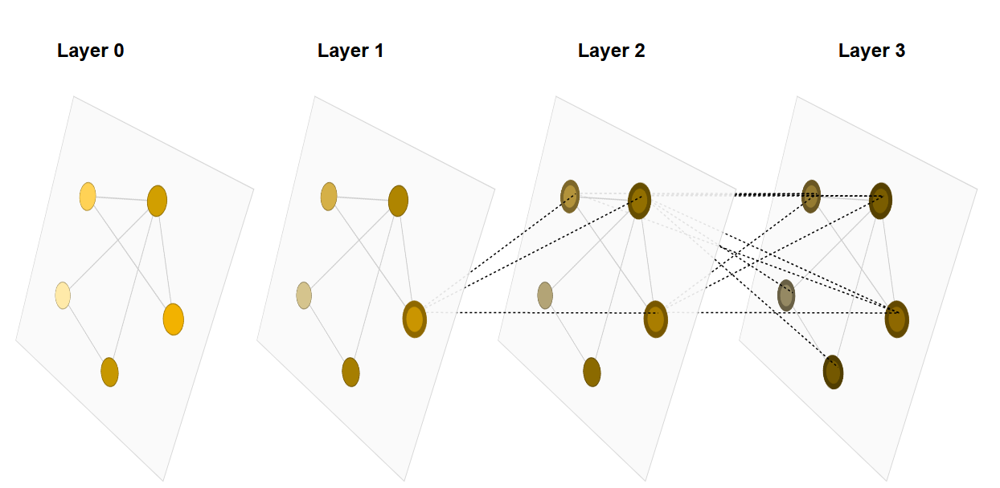

# A Gentle Introduction to Graph Neural Networks

* A graph represents the relations (edges) between a collection of entities (nodes). 

1. Graph can represent a lot of kinds of datas (converted into a graph)(representation of connection)
2. Three elements of a graph: graph, node, edge, these can be use to classify: task-level, MLP categories, pooling method, convolution method
3. When we evaluate a GNN, we focus on the relationship betweem AUC and: number of parameters, embdding dimension(U,V,E), layers, aggregation type, meassage passing method; by a special kind of table

* Never ignore version before starting a project!!!